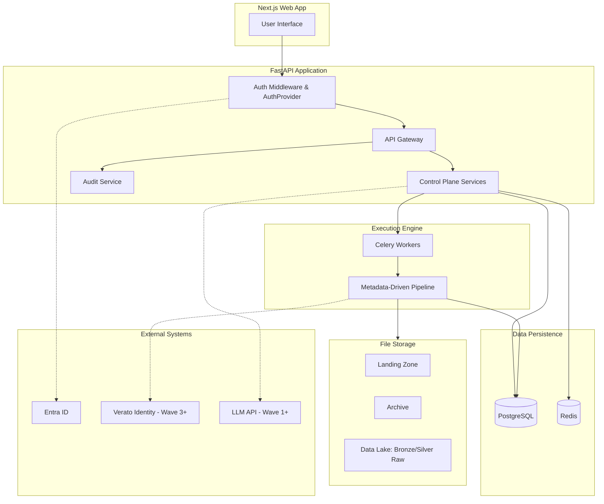
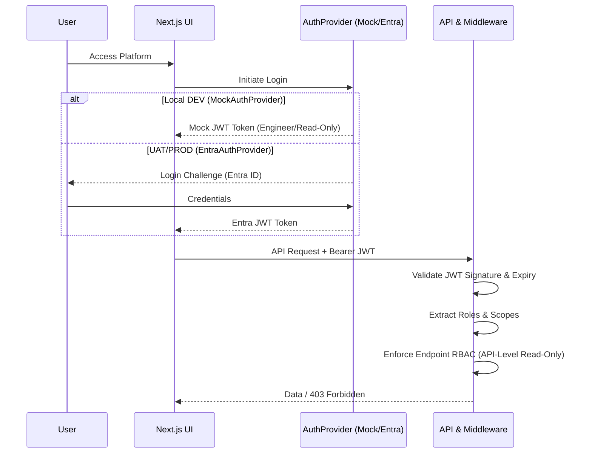
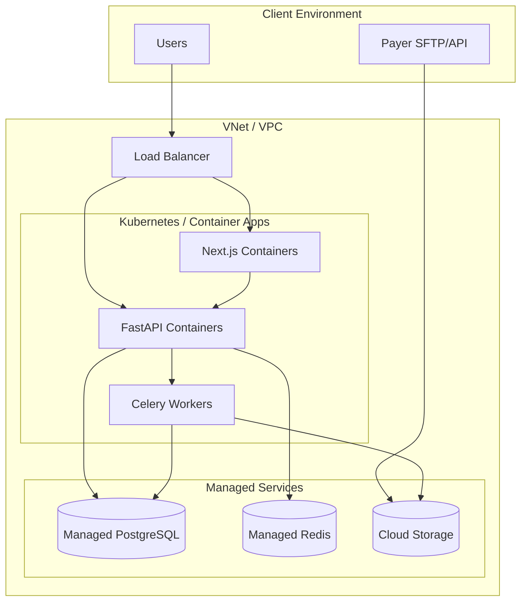
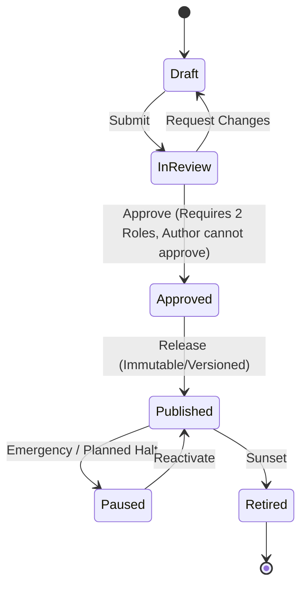

# CINQFLOW Architecture Document

This document serves as the technical blueprint for the CINQFLOW healthcare data platform. It outlines the architectural decisions, design patterns, and structural layout of the system, ensuring alignment with the project's core requirements: metadata-driven execution, deterministic behavior, strict PHI protection, and fully governed state changes.

## 1. System Architecture Overview

CINQFLOW is designed as a modular, metadata-driven platform. The architecture separates the control plane (configuration, governance, AI assistance) from the execution plane (data processing pipelines).

### Design Principles
- **Metadata-Driven**: Feed-specific behavior is derived entirely from approved configuration (schema, mappings, rules), never from feed-specific code. The pipeline compiler consumes GENERIC metadata. There must be no feed-specific code branching (e.g., no `if feed == 'FIDELIS'`).
- **Deterministic**: The core pipeline (Wave 0) relies on deterministic processing. AI is used strictly as an assistant in the control plane and never makes unapproved decisions or modifies data automatically.
- **Immutability & Idempotence**: Source data in Bronze is immutable. Idempotent input processing: repeated submission of the same input fingerprint must not create duplicate processing or duplicate results. Implemented via input fingerprint/hash, unique database constraints, input registry, batch state, stage state, and transaction boundaries.
- **Governed State**: Every configuration change flows through a strict state machine (Draft → Approved → Published) and requires explicit human approval. Authors cannot approve their own changes. Published configurations are immutable and versioned.
- **Privacy by Design**: PHI is protected structurally through scoping, masking services, and pre-flight sanitization before any external interactions (like AI prompts). Unmasked PHI is never sent to AI models.
- **External Systems**: The system does not assume external production systems are available. It relies on adapter/interface boundaries for external systems and does not create fake implementations pretending production integrations are complete.

### Technology Stack Choices
- **Frontend**: Next.js 14+ (App Router) with TypeScript, Tailwind CSS, shadcn/ui. Chosen for strong typing, server components, and responsive design.
- **Backend**: Python 3.12+ with FastAPI. Chosen for high-performance asynchronous execution, robust type hinting (Pydantic), and excellent AI/data library ecosystem.
- **Database**: PostgreSQL 16+. Chosen for reliable relational data storage, strong transaction support, and JSONB capabilities for schema flexibility.
- **Task Queue**: Celery with Redis. Chosen for distributed, asynchronous background task processing (pipelines, schedules).
- **Cache**: Redis. Chosen for fast session state and metadata caching.
- **Auth**: AuthProvider interface pattern (MockAuthProvider for local DEV, EntraAuthProvider for UAT/PROD).
- **File Storage**: Abstracted (Local FS in Dev, Azure Blob/AWS S3 adapters for Prod). Chosen for portability and vendor agnosticism.
- **AI**: Abstracted LLM Adapter. Chosen to avoid vendor lock-in; ensures all prompts pass through the internal PHI scrubbing service.

### Wave Boundaries
CINQFLOW development and rollout are structured into clear waves:
- **Wave 0**: Foundation + one deterministic feed. Pipeline scope stops at Landing → Bronze → Silver Raw → Quarantine → Reconciliation → Audit. No AI in Wave 0.
- **Wave 1**: BA self-service + schema + mapping + rules + AI proposals.
  - *Slice 1 (Completed & Accepted)*: Deterministic File Profiler + Schema Contract foundation (empirical observation facts vs human-governed schema contract decisions).
  - *Slice 2 (Current Focus)*: BA Feed Lifecycle, Feed Cloning with strict isolation, and Five-Step Onboarding Wizard Shell.
    - Feed state machine: `DRAFT` → `ACTIVE` → `INACTIVE` → `RETIRED`. Feed may transition to `ACTIVE` only when metadata is valid, a configuration version exists, onboarding prerequisites are met, and an associated schema exists with a `PUBLISHED` version (no prerequisite merely DRAFT).
    - Feed cloning: Independent metadata, independent version UUID, independent JSON configuration snapshot; modifying the clone never mutates the source feed.
    - Onboarding wizard: Guided stepper coordinator (`Feed Setup` → `Sample & Profiling` → `Schema Contract` → `Mapping (Slice 3 Preview)` → `Review & Activate`).
    - Scope exclusion: No AI, no Mapping Studio implementation, no canonical model browser, no transforms, no natural-language rules, no scheduling, no multi-party approvals.
- **Wave 2**: Operations (monitoring, scheduling, alerts).
- **Wave 3**: Identity Resolution + Canonical ODS + complex formats.
- **Wave 4**: Trust + Governance + Catalog + Copilot.
- **Wave 5**: Migration + parallel run + cutover + ownership.

### Demonstration Feed & Real Pipeline Execution (Wave 0)
Wave 0 includes a deterministic sample CSV feed with valid and intentionally invalid records to prove: **Input rows = Silver Raw rows + Quarantined rows**.
The Wave 0 demo must actually perform real pipeline execution: discover/read feed metadata, detect the file, register input, fingerprint, reject duplicates, validate, create batch, execute Landing, write immutable Bronze, transform Silver Raw, route invalid records to quarantine, reconcile counts, record audit events, expose batch/stage status through API, and support restart from a failed stage.

### High-Level Component Diagram



---

## 2. Frontend Architecture

The frontend is a modern web application built with **Next.js 14+ (App Router)** and TypeScript.

- **App Structure & Routing**: Utilizes the App Router for nested layouts and server-side rendering. Routes map to core domains: `/registry`, `/studio`, `/operations`, `/admin`.
- **State Management**: React Context API for global state (auth, scopes) and React Query (TanStack Query) for server state caching, background fetching, and optimistic updates.
- **Component Library**: Tailwind CSS combined with `shadcn/ui` provides a highly customizable, accessible, and consistent design system.
- **Form Handling**: `react-hook-form` coupled with Pydantic-compatible `zod` schemas for robust client-side validation mirroring backend constraints.
- **Real-Time Updates**: Server-Sent Events (SSE) or WebSockets are used for pipeline status monitoring and AI suggestion streaming.

---

## 3. Backend Architecture

The backend is built with **Python 3.12+ and FastAPI**, structured around Domain-Driven Design (DDD) principles.

- **Application Structure**: Divided into domains (e.g., Feed Registry, Execution, Identity, Auth).
- **Service Layer & Repository Pattern**: API routers handle HTTP concerns and delegate to business logic (Services), which interact with data stores via Repositories. This decouples business rules from the database.
- **Dependency Injection**: FastAPI's native DI system provides services, database sessions, and current-user context into routes.
- **Middleware Stack**:
  - **Auth/RBAC Middleware**: Validates user identity via AuthProvider and enforces scope-based access (source, feed, domain, environment) on every request.
  - **Audit Middleware**: Automatically intercepts and logs before/after states for any mutating request.
  - **Error Handling**: Standardizes error responses (Problem Details format) while ensuring no PHI leaks in error messages.

---

## 4. Database Architecture

**PostgreSQL 16+** serves as the central control database.

- **Schema Design Approach**: Strongly relational for control data (feeds, rules, mappings). JSONB is used judiciously for unstructured metadata (e.g., raw API responses).
- **Migration Strategy**: `Alembic` manages all schema migrations. Migrations are executed as part of the CI/CD pipeline.
- **Connection Pooling**: `PgBouncer` or SQLAlchemy's connection pooling is utilized to manage connections efficiently across FastAPI workers and Celery tasks.
- **Multi-Tenancy & Scoping**: Row-level security (RLS) or explicit tenant/scope IDs on core tables enforce access boundaries.
- **Audit Columns**: Every table includes `created_by`, `created_at`, `updated_by`, and `updated_at`. Mutating actions append to a central, immutable `audit_log` table.

---

## 5. Pipeline/Execution Architecture

The execution engine is fully **metadata-driven**. The pipeline compiler consumes GENERIC metadata. No feed-specific code branching exists. It reads approved configurations and executes data flows using Celery distributed workers.

### Data Flow Diagram

```mermaid
graph LR
    Source[Payer/Provider Data] --> Landing[Landing Zone]
    Landing --> Bronze[Bronze Layer]
    Bronze --> SilverRaw[Silver Raw Layer]
    
    SilverRaw -. "Wave 3+" .-> Identity[Verato Identity Layer]
    Identity -. "Wave 3+" .-> SilverODS[Silver ODS]

    subgraph Wave 0 Pipeline Engine [Metadata-Driven Engine]
        direction TB
        L[File Registration & Validation]
        B[Immutable Source Copy]
        SR[Apply Mappings & Rules]
        Q[Route to Quarantine]
        R[Reconciliation]
        A[Audit]
        
        L --> B
        B --> SR
        SR --> Q
        SR --> R
        R --> A
    end
    
    Quarantine[Quarantine Area]
    Wave 0 Pipeline Engine --> Quarantine
```

- **Execution Stages (Wave 0)**:
  - **Landing**: Validates file arrival, registers it, and fingerprints it to prevent duplicate processing.
  - **Bronze**: Exact, untouched copy of the source data. Must preserve the original source unchanged.
  - **Silver Raw**: Applies approved structural transforms, mappings, and basic DQ rules based entirely on generic configuration.
  - **Quarantine**: Bad records route here with explicit reasons. The original raw records are preserved.
  - **Reconciliation**: Measurable row reconciliation ensuring Input rows = Silver Raw rows + Quarantined rows.
  - **Audit**: Every important state change and record movement is audited.
- **Wave 3+ Stages**:
  - **Identity**: Interfaces with Verato for crosswalk generation and identity resolution.
  - **Silver ODS**: Generates surrogate keys, applies business deduplication, loads canonical model, and enforces foreign key relationships.
- **Idempotency & Restart Capability**: Idempotent input processing guarantees that repeated submission of the same input fingerprint must not create duplicate processing or duplicate results. This is enforced via input fingerprint/hash, unique database constraints, input registry, batch state, stage state, and transaction boundaries. If a batch fails, the pipeline execution supports restart precisely from the last completed stage.

---

## 6. Authentication & Authorization Architecture

- **AuthProvider Interface Pattern**: Authentication uses an interface pattern to allow seamless swapping between environments.
  - **MockAuthProvider**: For local DEV. Local development must NOT require real Entra ID. Supports local testing of roles like Engineer and Read-Only.
  - **EntraAuthProvider**: For UAT/PROD. Uses Microsoft Entra ID via MSAL. JWT tokens are verified by FastAPI.
- **RBAC**: 7 explicit roles: Business Analyst, Data Steward, Data Engineer, Operations, Approver, Administrator, Read-Only.
- **Scope-Based Filtering**: Permissions are scoped down to specific sources, feeds, domains, and environments. Enforced server-side at the repository layer.
- **Read-Only Enforcement**: Read-only access must be enforced at the API/data layer. Read-only users have zero mutating permissions at the backend; the UI merely reflects this by hiding buttons, but enforcement is strict on the server side.

### Authentication Flow



---

## 7. Audit Architecture

The platform provides a complete, searchable, and immutable audit trail.
- **Scope**: Every state change (create, update, delete, approve, run) is logged.
- **Detail**: Records include actor ID, actor type (human, system, AI), timestamp, before values, after values, and explicit reasons/rationales.
- **Immutability**: Audit tables are append-only. Deletions or modifications of audit logs are explicitly blocked at the database level.

---

## 8. AI Architecture

AI is used to accelerate the control plane (e.g., schema inference, mapping suggestions, plain-English rule generation).
- **Abstracted LLM Adapter**: No specific provider is assumed; an adapter interface allows swapping models (e.g., Azure OpenAI, local models).
- **PHI Scrubbing**: A mandatory scrubbing service strips all identified PHI from prompts before they leave the environment.
- **Proposal-Only Pattern**: AI output is always a proposal until human approval. The AI generates drafts with confidence scores. It never auto-applies or modifies data. AI must not invent unsupported values.

---

## 9. External Integration Architecture

All external dependencies communicate via strict Adapter/Interface boundaries, ensuring the core domain is isolated from third-party changes.
- **Databricks / Airflow**: Interfaces for triggering remote jobs or querying external cluster state.
- **Verato**: Identity adapter managing requests, responses, and API retries (Wave 3+).
- **Storage / Notifications / Auth**: Clean interfaces for seamless swapping between local dev implementations (like MockAuthProvider) and production cloud services. Do not create fake implementations pretending production integrations are complete.

---

## 10. Storage Architecture

- **Abstraction**: `StorageAdapter` interface supports local file system (dev/test) and Azure Blob / S3 (production).
- **Landing Zones**: Dedicated drop zones with strict file permissioning.
- **Immutability**: Once a file hits the Bronze layer, it is read-only.
- **Archive Strategy**: Successfully processed files are moved to an archive tier; invalid files are routed to a rejected zone.

---

## 11. Scheduling Architecture

- **Management**: Feed schedules are stored as metadata.
- **Engine**: A Celery Beat scheduler triggers runs based on configuration.
- **Dependency Resolution**: Execution respects declared upstream dependencies. If an upstream batch fails or is held, downstream batches pause automatically.

---

## 12. Observability Architecture

- **Logging**: Structured JSON logging across all components.
- **Metrics**: Prometheus-compatible metric endpoints exposing batch durations, queue depths, and API latency.
- **Alerting**: Alerting framework integrated with the metadata rules (e.g., a "Stop pipeline" rule triggers a PagerDuty or Teams notification via the notification adapter).

---

## 13. Deployment Architecture

- **Containerization**: Everything runs in Docker containers.
- **Promotion**: Configurations move DEV → UAT → PROD. The promoted configuration is byte-identical, merely swapping environment-specific parameters. Published configuration is immutable and versioned.
- **CI/CD**: Automated pipelines run tests, build images, and apply database migrations.

### Deployment Topology



---

## 14. Security/PHI Handling Architecture

- **Classification**: A metadata dictionary classifies fields (e.g., Names, DOBs) as PHI.
- **Masking Service**: Intercepts reads at the presentation layer; masks PHI dynamically based on the user's role authorization. Unmasking is an explicitly audited action.
- **Export Controls**: Downloads are filtered and watermarked.
- **AI Sanitization**: As mentioned, prompt interceptors prevent PHI egress. Do not send unmasked PHI to AI models.

---

## 15. Environment Architecture

- **Separation**: Distinct, isolated environments for DEV, UAT, and PROD.
- **Configuration Promotion**: Features like mappings and rules deploy through release windows, exactly like code. Server-side logic enforces that required approvals are met and that an author cannot approve their own change.
- **Environment Variables**: Managed securely via vault services (e.g., Azure Key Vault), injected at runtime.

---

## Repository Structure

```
cinqflow/
├── frontend/          # Next.js application
├── backend/           # FastAPI application
│   ├── api/           # Route handlers
│   ├── core/          # Config, security, middleware
│   ├── models/        # SQLAlchemy models
│   ├── schemas/       # Pydantic schemas
│   ├── services/      # Business logic
│   ├── adapters/      # External system interfaces
│   ├── engine/        # Pipeline execution engine
│   └── workers/       # Celery task definitions
├── database/          # Alembic migrations
├── tests/             # Unit and integration tests
├── docs/              # Additional documentation
├── docker/            # Dockerfiles and compose setups
└── config/            # Environment configurations
```

---

### Approval Workflow State Machine


