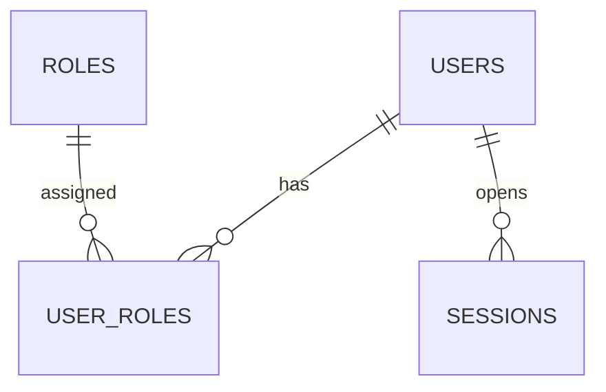
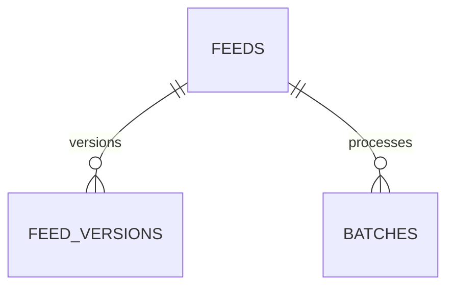
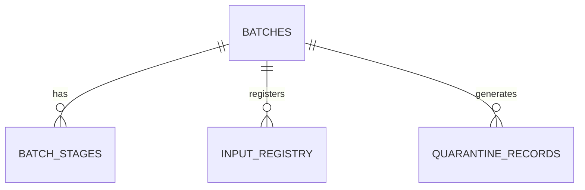

# CINQFLOW Database Design

This document details the database schema for the CINQFLOW platform. It is strictly divided into two sections: tables to be created in Wave 0 (deterministic, foundation pipeline), and tables planned for future waves.

## Standard Mixins & Enums

### Audit Mixin Columns
Every stateful table in the system (unless explicitly an append-only log) MUST include the following audit columns:
- `created_at` (TIMESTAMPTZ, NOT NULL, DEFAULT NOW())
- `created_by` (UUID, NOT NULL)
- `updated_at` (TIMESTAMPTZ, NOT NULL, DEFAULT NOW())
- `updated_by` (UUID, NOT NULL)

### Core Enums
- **`auth_provider`**: `('Mock', 'Entra')`
- **`feed_format`**: `('CSV', 'JSON', 'Parquet', 'XML', 'HL7', 'X12')`
- **`batch_status`**: `('Pending', 'Running', 'Success', 'Failed', 'Cancelled')`
- **`stage_name`**: `('Landing', 'Bronze', 'Silver Raw')` *(Identity and Silver ODS are added in Wave 3)*
- **`stage_status`**: `('Pending', 'Running', 'Success', 'Failed')`

---

## Section 1: Wave 0 Tables (IMPLEMENT NOW)

Only these ~15 tables are to be created during Wave 0.

### Domain: Authentication

#### ER Diagram

#### `users`
**Purpose**: Core user identities supporting MockAuthProvider (local dev) and EntraAuthProvider (production).
- `id` (UUID, PK, DEFAULT uuid_generate_v4())
- `username` (VARCHAR, NOT NULL)
- `email` (VARCHAR, NOT NULL)
- `auth_provider` (ENUM auth_provider, NOT NULL)
- `auth_provider_id` (VARCHAR, NULL) - Entra OID or mock ID
- `is_active` (BOOLEAN, NOT NULL, DEFAULT true)
- *Audit Mixin Columns*

**Constraints & Indexes**:
- UNIQUE (`email`)
- UNIQUE (`auth_provider_id`, `auth_provider`)
- INDEX on `email`, `auth_provider_id`
**Business Rules**: Mock users can be created locally; Entra users are synced on first login.

#### `roles`
**Purpose**: System roles (e.g., Engineer, Read-Only for Wave 0).
- `id` (UUID, PK, DEFAULT uuid_generate_v4())
- `name` (VARCHAR, NOT NULL)
- `description` (TEXT, NULL)
- *Audit Mixin Columns*

**Constraints & Indexes**: UNIQUE (`name`)

#### `user_roles`
**Purpose**: Maps users to roles.
- `id` (UUID, PK, DEFAULT uuid_generate_v4())
- `user_id` (UUID, NOT NULL) - FK to `users`
- `role_id` (UUID, NOT NULL) - FK to `roles`
- *Audit Mixin Columns*

**Constraints & Indexes**: UNIQUE (`user_id`, `role_id`)

#### `sessions`
**Purpose**: Tracks active user sessions for timeout and audit purposes.
- `id` (UUID, PK, DEFAULT uuid_generate_v4())
- `user_id` (UUID, NOT NULL) - FK to `users`
- `token_hash` (VARCHAR, NOT NULL)
- `expires_at` (TIMESTAMPTZ, NOT NULL)
- `ip_address` (VARCHAR, NULL)
- `user_agent` (TEXT, NULL)
- `created_at` (TIMESTAMPTZ, NOT NULL, DEFAULT NOW())
*(No full audit mixin as this is a transient/append-oriented log)*

**Constraints & Indexes**: INDEX on `token_hash`, INDEX on `expires_at`

---

### Domain: Contract Register

#### `contract_register_entries`
**Purpose**: Tracks data contracts (reads/writes/unknowns) for each user story.
- `id` (UUID, PK, DEFAULT uuid_generate_v4())
- `story_id` (VARCHAR, NOT NULL) - e.g., 'CF-101'
- `domain` (VARCHAR, NOT NULL)
- `description` (TEXT, NOT NULL)
- `reads` (JSONB, NOT NULL, DEFAULT '{}')
- `writes` (JSONB, NOT NULL, DEFAULT '{}')
- *Audit Mixin Columns*

**Constraints & Indexes**: UNIQUE (`story_id`)

#### `contract_unknowns`
**Purpose**: Unconfirmed assumptions associated with a contract entry.
- `id` (UUID, PK, DEFAULT uuid_generate_v4())
- `contract_entry_id` (UUID, NOT NULL) - FK to `contract_register_entries`
- `assumption` (TEXT, NOT NULL)
- `status` (VARCHAR, NOT NULL) - 'Open', 'Resolved'
- `resolution` (TEXT, NULL)
- *Audit Mixin Columns*

**Constraints & Indexes**: INDEX on `contract_entry_id`, `status`

---

### Domain: Feed Registry

#### ER Diagram

#### `feeds`
**Purpose**: Core feed definitions controlling metadata-driven ELT logic.
- `id` (UUID, PK, DEFAULT uuid_generate_v4())
- `name` (VARCHAR, NOT NULL)
- `domain` (VARCHAR, NOT NULL)
- `format` (ENUM feed_format, NOT NULL)
- `landing_folder` (VARCHAR, NOT NULL)
- `file_pattern` (VARCHAR, NOT NULL)
- `schedule` (VARCHAR, NULL) - Cron expression
- `is_active` (BOOLEAN, NOT NULL, DEFAULT true)
- *Audit Mixin Columns*

**Constraints & Indexes**: UNIQUE (`name`)
**Business Rules**: Feeds define deterministic processing boundaries. No feed-specific code is allowed; behavior is driven by metadata here and in versions.

#### `feed_versions`
**Purpose**: Immutable, versioned configuration for feeds.
- `id` (UUID, PK, DEFAULT uuid_generate_v4())
- `feed_id` (UUID, NOT NULL) - FK to `feeds`
- `version_number` (INT, NOT NULL)
- `config` (JSONB, NOT NULL) - Extractor/loader specific configs
- `effective_date` (TIMESTAMPTZ, NOT NULL)
- *Audit Mixin Columns*

**Constraints & Indexes**: UNIQUE (`feed_id`, `version_number`)

---

### Domain: Pipeline Execution

#### ER Diagram

#### `batches`
**Purpose**: Represents a single execution run of a feed pipeline.
- `id` (UUID, PK, DEFAULT uuid_generate_v4())
- `feed_id` (UUID, NOT NULL) - FK to `feeds`
- `feed_version_id` (UUID, NOT NULL) - FK to `feed_versions`
- `data_date` (DATE, NOT NULL)
- `status` (ENUM batch_status, NOT NULL)
- `start_time` (TIMESTAMPTZ, NOT NULL, DEFAULT NOW())
- `end_time` (TIMESTAMPTZ, NULL)
- `error_message` (TEXT, NULL)
- *Audit Mixin Columns*

**Constraints & Indexes**: INDEX on `feed_id`, `status`
**Business Rules**: Batch executions must support restartability from the last completed stage.

#### `batch_stages`
**Purpose**: Status tracking per pipeline stage (Landing, Bronze, Silver Raw).
- `id` (UUID, PK, DEFAULT uuid_generate_v4())
- `batch_id` (UUID, NOT NULL) - FK to `batches`
- `stage` (ENUM stage_name, NOT NULL)
- `status` (ENUM stage_status, NOT NULL)
- `start_time` (TIMESTAMPTZ, NOT NULL, DEFAULT NOW())
- `end_time` (TIMESTAMPTZ, NULL)
- `error_message` (TEXT, NULL)
- *Audit Mixin Columns*

**Constraints & Indexes**: UNIQUE (`batch_id`, `stage`)

#### `input_registry`
**Purpose**: Tracks files processed in a batch with fingerprints to prevent duplicate processing.
- `id` (UUID, PK, DEFAULT uuid_generate_v4())
- `batch_id` (UUID, NOT NULL) - FK to `batches`
- `file_path` (VARCHAR, NOT NULL)
- `file_name` (VARCHAR, NOT NULL)
- `file_size` (BIGINT, NOT NULL)
- `row_count` (INT, NULL)
- `sha256_hash` (VARCHAR, NOT NULL)
- `processed_at` (TIMESTAMPTZ, NOT NULL, DEFAULT NOW())
- *Audit Mixin Columns*

**Constraints & Indexes**: UNIQUE (`sha256_hash`)
**Business Rules**: Idempotency enforcement. Duplicate files must never create duplicate processing.

#### `quarantine_records`
**Purpose**: Stores bad records rejected during the pipeline with explicit reasons.
- `id` (UUID, PK, DEFAULT uuid_generate_v4())
- `batch_id` (UUID, NOT NULL) - FK to `batches`
- `stage` (ENUM stage_name, NOT NULL)
- `record_data` (JSONB, NOT NULL) - The exact original data that failed
- `reason_code` (VARCHAR, NOT NULL)
- `reason_message` (TEXT, NOT NULL)
- *Audit Mixin Columns*

**Constraints & Indexes**: INDEX on `batch_id`, `stage`, `reason_code`
**Business Rules**: Must preserve bad records verbatim. No PHI to AI models in Wave 0.

---

### Domain: Reconciliation

#### `batch_reconciliation`
**Purpose**: Per-stage row counts to ensure data integrity and observability.
- `id` (UUID, PK, DEFAULT uuid_generate_v4())
- `batch_id` (UUID, NOT NULL) - FK to `batches`
- `stage` (ENUM stage_name, NOT NULL)
- `rows_in` (INT, NOT NULL, DEFAULT 0)
- `rows_out` (INT, NOT NULL, DEFAULT 0)
- `rows_quarantined` (INT, NOT NULL, DEFAULT 0)
- `rows_dropped` (INT, NOT NULL, DEFAULT 0)
- *Audit Mixin Columns*

**Constraints & Indexes**: UNIQUE (`batch_id`, `stage`)
**Business Rules**: `rows_in = rows_out + rows_quarantined + rows_dropped`. Row reconciliation must be measurable.

#### `reconciliation_ledger_entries`
**Purpose**: Named-reason ledger for rows dropped during processing.
- `id` (UUID, PK, DEFAULT uuid_generate_v4())
- `batch_id` (UUID, NOT NULL) - FK to `batches`
- `stage` (ENUM stage_name, NOT NULL)
- `drop_reason` (VARCHAR, NOT NULL)
- `drop_count` (INT, NOT NULL)
- *Audit Mixin Columns*

**Constraints & Indexes**: UNIQUE (`batch_id`, `stage`, `drop_reason`)

---

### Domain: Audit

#### `audit_events`
**Purpose**: Immutable, append-only log of every important state change.
- `id` (UUID, PK, DEFAULT uuid_generate_v4())
- `timestamp` (TIMESTAMPTZ, NOT NULL, DEFAULT NOW())
- `actor_id` (UUID, NULL) - Nullable if system action
- `entity_type` (VARCHAR, NOT NULL)
- `entity_id` (UUID, NOT NULL)
- `action` (VARCHAR, NOT NULL) - e.g., 'Create', 'Update', 'Delete', 'Execute'
- `old_values` (JSONB, NULL)
- `new_values` (JSONB, NULL)
- `ip_address` (VARCHAR, NULL)

**Constraints & Indexes**: INDEX on `entity_type`, `entity_id`, INDEX on `actor_id`
**Business Rules**: Read-only via application layer.

---

## Section 2: Future Wave Tables (DOCUMENTED ONLY — NOT CREATED IN WAVE 0)

These tables illustrate the architectural runway for subsequent waves. **Do not create these in Wave 0.**

### Wave 1: Dynamic Mappings & AI Generation
- **`schemas`**: Standardized output schemas definitions.
- **`schema_versions`**: Version history of schemas (immutable configurations).
- **`schema_fields`**: Columns/fields within a given schema version.
- **`mappings`**: Definitions of feed-to-schema transformations.
- **`mapping_versions`**: Immutable transformation mapping configurations.
- **`mapping_lines`**: Individual field-level mapping rules.
- **`rules`**: Validation and DQ rules to apply to mappings.
- **`rule_versions`**: Version history of DQ rules.
- **`rule_test_results`**: Historical outcomes of mapping rule validation.
- **`approval_requests`**: Tracking human-in-the-loop approvals (AI proposals).
- **`approval_decisions`**: Auditable records of who approved/rejected what.
- **`glossary_terms`**: Enterprise business glossary metadata.
- **`schedules`**: Pipeline orchestration schedules.
- **`schedule_dependencies`**: Inter-pipeline dependencies (DAG edges).

### Wave 2: Operations & Data Quality
- **`incidents`**: Pipeline or DQ incident tickets.
- **`failure_fingerprints`**: Deduplication of known failure modes.
- **`recovery_guides`**: Playbooks for resolving specific failure fingerprints.
- **`dq_results`**: Data quality execution metrics and violations.
- **`variances`**: Allowed threshold deviations in data quality.
- **`batch_certifications`**: Human sign-off on specific data batches.
- **`waivers`**: Temporary exceptions granted for DQ rules.

### Wave 3: Identity Resolution & Silver ODS
*(Note: 'Identity' and 'Silver ODS' are added to the pipeline stages here)*
- **`identity_requests`**: Records routed for identity matching.
- **`identity_responses`**: Matching engine outputs and scores.
- **`crosswalk`**: Enterprise master patient/provider index linkages.
- **`identity_exceptions`**: Unresolvable or anomalous identity clusters.
- **`merge_split_decisions`**: Manual steward overrides for identity groups.
- **`ods_model_versions`**: Versioning for the canonical Silver ODS schema.
- **`ods_certifications`**: Conformance certifications for ODS data.
- **`consumer_registrations`**: Downstream systems registering to consume ODS data.

### Wave 4: Governance & Enterprise Access
- **`role_scopes`**: Fine-grained access control boundaries (PHI scope).
- **`access_reviews`**: Periodic audits of user permissions.
- **`emergency_access_grants`**: Break-glass access logs.
- **`releases`**: Bundled configurations for deployment.
- **`release_items`**: Specific configuration versions in a release.
- **`freeze_periods`**: Change blackout windows.
- **`catalog_entries`**: Data discovery metadata for downstream users.
- **`knowledge_articles`**: Wiki/documentation for data assets.

### Wave 5: Cloud Migration
- **`migration_feeds`**: Feeds targeted for transition to target state.
- **`migration_waves`**: Groupings of feeds for structured cutover.
- **`migration_evidence`**: Dual-run reconciliation proofs.
- **`migration_cutover_checklists`**: Structured steps for taking feeds live.
- **`ownership_transfers`**: Handover tracking from legacy to new platform.

---

## Migration Strategy

Database migrations should follow an evolutionary approach:
1. **Wave 0 (Current)**: Implement foundational deterministic structures. Use Alembic/Flyway with strictly forward-only scripts.
2. **Configuration Immutability**: Any configuration table (e.g. `feed_versions`) MUST never UPDATE rows. Only INSERT new versions.
3. **Approvals**: For later waves, server-side checks will ensure that the user ID requesting an approval is NOT the same user ID executing the approval (separation of duties).
