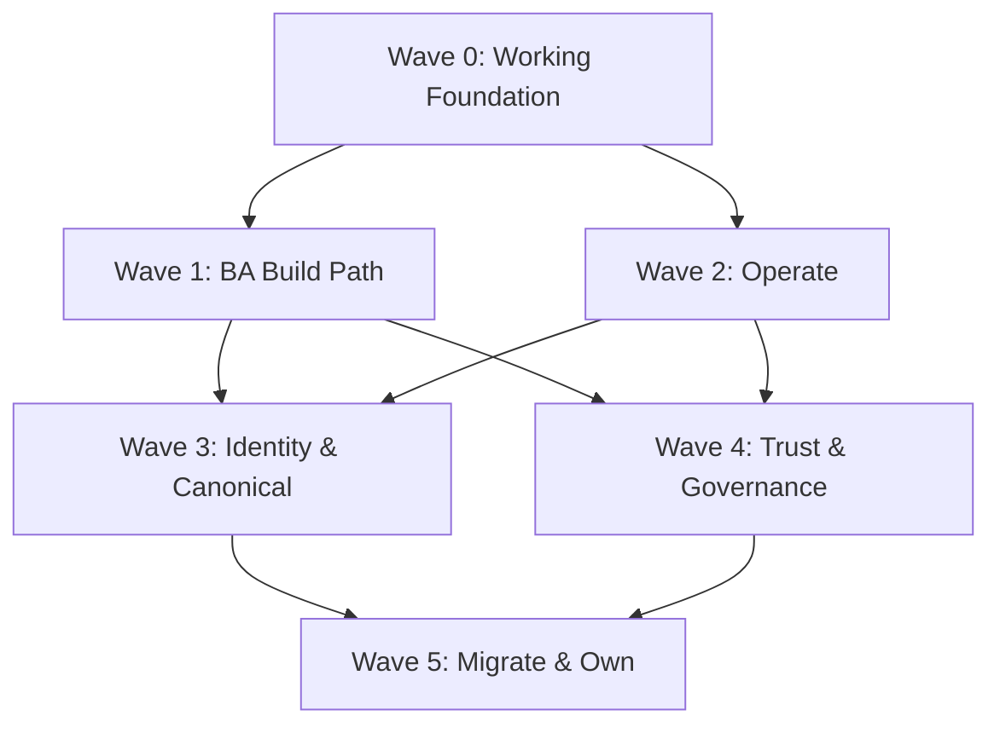

# CINQFLOW Development Plan

## Wave Boundaries
- **Wave 0**: Foundation + one deterministic feed. Pipeline stops at Landing → Bronze → Silver Raw. NO ODS, NO Identity in Wave 0.
- **Wave 1**: BA self-service build path + schema + mapping + rules + AI-assisted proposals.
- **Wave 2**: Operations.
- **Wave 3**: Identity Resolution + Canonical ODS + complex formats. (ODS and Identity are built here).
- **Wave 4**: Trust + Governance + Catalog + Copilot.
- **Wave 5**: Migration + parallel run + cutover + ownership.

## Wave Dependency Graph

## Critical Path Analysis
1. **Wave 0 (Foundation)**: Pre-requisite to all work. Blocking.
2. **Wave 1 (BA Build Path)**: Unlocks Canonical/Identity work.
3. **Wave 3 (Identity & Canonical)**: The highest technical risk and complexity.
4. **Wave 4 (Governance)**: Required before production migrations.
5. **Wave 5 (Migration)**: Final milestone.
**Critical Path:** Wave 0 → Wave 1 → Wave 3 → Wave 4 → Wave 5.

## Wave 0 Day-by-Day Sequence
- **Days 1-2**: Project scaffolding, Docker Compose (Postgres + Redis), FastAPI skeleton, Next.js skeleton, Alembic setup, MockAuthProvider
- **Days 3-4**: Wave 0 database tables only, audit service, lifecycle engine foundation
- **Days 5-6**: Feed registry (6 fields + versioning + pattern validation), contract register
- **Days 7-8**: Pipeline engine (Landing → Bronze → Silver Raw), batch control, stage tracking, quarantine routing
- **Days 9-10**: Landing zone controls, input registry, file fingerprinting, duplicate rejection
- **Days 11-12**: Count reconciliation, named-reason drop ledger, balance verification
- **Days 13-14**: Demo feed CSV, end-to-end integration test, Wave 0 acceptance proof

## Story Implementation Plan

### Wave 0 — Working Foundation

> **Wave 0 Scope Constraints:**
> - Wave 0 strictly implements Landing → Bronze → Silver Raw.
> - ODS and Identity resolution are out of scope (Wave 3).
> - Pipeline compiler consumes generic metadata (no feed-specific branching like `if feed == 'FIDELIS'`).
> - Idempotent input processing: repeated submission of the same input fingerprint must not create duplicate processing or duplicate results.
> - Only Wave 0 database tables and APIs are created/implemented (auth, contract register, feed registry, input registration, pipeline execution, batch status, reconciliation, audit). Future tables and APIs are documented but not created.
> - Real execution of the full pipeline must be demonstrated. No fake success responses.

**CF-V0-E1-01: Execution-Plane Contract Register**
- Wave: 0 | Epic: Epic 1 | Persona: Data Engineer | Class: Standard
- Modules: React UI, FastAPI Backend, PostgreSQL
- Dependencies: None
- DB: `contract_register` table
- API: `POST /api/contracts`, `GET /api/contracts`
- UI: Contract form
- Pipeline: None
- Tests: Unit (CRUD), Integration (DB), E2E (UI)
- External: None
- AC Impl: React form posting to FastAPI, persisting assumptions.
- Risks: Schema evolution.

**CF-V0-E2-01: Sign-in with Company Account and Basic Roles**
- Wave: 0 | Epic: Epic 2 | Persona: Admin | Class: Standard
- Modules: Auth
- Dependencies: None
- DB: `users`, `roles`
- API: `GET /auth/login`
- UI: Login page
- Pipeline: None
- Tests: Unit, E2E Auth
- External: None for Wave 0
- AC Impl: Wave 0 uses AuthProvider interface with MockAuthProvider for local dev (Engineer + Read-Only). Entra ID is NOT required for Wave 0 development. Strict RBAC check.
- Risks: None in local mock.

**CF-V0-E3-01: Minimal Feed Record the Engine Can Run From**
- Wave: 0 | Epic: Epic 3 | Persona: Data Engineer | Class: Standard
- Modules: Metadata API
- Dependencies: CF-V0-E2-01
- DB: `feed_registry`
- API: `POST /api/feeds`
- UI: Feed creation wizard
- Pipeline: Bronze ingestion triggered by metadata
- Tests: Integration, Engine parse test
- External: None
- AC Impl: Strict JSON schema validation. Configure generic metadata to run the demo feed.
- Risks: Malformed regex.

**CF-V0-E8-01: Pipeline Compiler — Landing to Bronze to Silver Raw**
- Wave: 0 | Epic: Epic 8 | Persona: Data Engineer | Class: Standard
- Modules: Pipeline
- Dependencies: CF-V0-E3-01
- DB: `pipeline_state`
- API: `POST /api/pipeline/run`
- UI: Pipeline monitor
- Pipeline: Idempotent input processing: repeated submission of the same input fingerprint must not create duplicate processing or duplicate results.
- Tests: E2E Pipeline
- External: Databricks
- AC Impl: Pure metadata-driven PySpark templates. No feed-specific code. Stops at Silver Raw.
- Risks: Performance at scale.

**CF-V0-E8-02: Landing Zone Controls**
- Wave: 0 | Epic: Epic 8 | Persona: Data Engineer | Class: Standard
- Modules: Pipeline
- Dependencies: CF-V0-E8-01
- DB: `file_manifest`
- API: None
- UI: None
- Pipeline: Pre-ingestion validation
- Tests: Unit tests for idempotency
- External: Blob Storage
- AC Impl: Duplicate detection using MD5 and file path.
- Risks: Race conditions on upload.

**CF-V0-E13-01: Count Reconciliation with Named-Reason Drop Ledger**
- Wave: 0 | Epic: Epic 13 | Persona: Data Engineer | Class: Standard
- Modules: Reconciliation
- Dependencies: CF-V0-E8-01
- DB: `drop_ledger`
- API: `GET /api/reconciliation`
- UI: Reconciliation dashboard
- Pipeline: Write to drop ledger on fail
- Tests: Integration
- External: None
- AC Impl: Row-level tracking of dropped records to ensure `In = Out + Dropped`.
- Risks: High volume of drops causing DB bloat.

**CF-V0-DEMO: Wave 0 End-to-End Acceptance Proof**
- Wave: 0 | Epic: Epic 13 | Persona: Data Engineer | Class: Standard
- Modules: E2E Test
- Dependencies: CF-V0-E8-01, CF-V0-E13-01
- AC Impl: Wave 0 includes a deterministic sample CSV with columns: `member_id, first_name, last_name, date_of_birth, gender`. Includes valid + intentionally invalid records. Must prove: `Input = Silver Raw + Quarantined` (e.g., 4 in = 3 Silver Raw + 1 Quarantine). Real execution of the full pipeline; no fake success responses.

### Wave 1 — BA Build Path
**CF-V1-E3-02: Full Source and Feed Registry (Wave 1 Slice 2)**
- Wave: 1 | Epic: 3 | Persona: Business Analyst | Class: Standard
- Modules: Metadata API, UI
- DB: Add `source_system`, `data_owner`, `sla_expectation`, `cloned_from_feed_id` to `feeds`.
- API/UI: Full feed forms with domain, owner, and SLA metadata.
- Auth: Server-side authorization grants `BUSINESS_ANALYST` (and `ENGINEER`) access to manage feeds; `READ_ONLY` receives 403 Forbidden.

**CF-V1-E3-03: Clone a Similar Feed (Wave 1 Slice 2)**
- Wave: 1 | Epic: 3 | Persona: Business Analyst | Class: Standard
- API: `POST /api/v1/feeds/{id}/clone`
- UI: Clone modal button and pre-filled form with name and pattern inputs.
- Impl: Strict clone isolation: new feed UUID, independent name and pattern, independent version UUID, independent JSON configuration snapshot. Modifying the clone must never modify the source feed.
- Tests: Unit tests for clone deep-copy and explicit independence verification.

**CF-V1-E3-04: Feed Lifecycle, Version History and Governed Activation (Wave 1 Slice 2)**
- Wave: 1 | Epic: 3 | Persona: Business Analyst / Data Steward | Class: Standard
- DB: `feeds`, `feed_versions`
- API: `PUT /api/v1/feeds/{id}/status`
- Impl: State machine enforcement (`DRAFT` → `ACTIVE` → `INACTIVE` → `RETIRED`).
  - Strengthened Activation Rule: Transition to `ACTIVE` is permitted ONLY when: (1) required feed metadata is valid, (2) a valid configuration version exists, (3) required onboarding prerequisites are complete, (4) an associated schema exists, (5) the schema has a `PUBLISHED` version, and (6) no required prerequisite is merely `DRAFT`.
  - Published versions are strictly immutable.

**CF-V1-E4-01: The Five-Step Onboarding Wizard Shell (Wave 1 Slice 2)**
- Wave: 1 | Epic: 4 | Persona: Business Analyst | Class: Standard
- DB: `onboarding_sessions` table tracking step completion.
- API: `GET /api/v1/onboarding/feed/{feed_id}`, `PUT /api/v1/onboarding/feed/{feed_id}/step`
- UI: Five-step Next.js wizard (`Feed Setup` → `Sample & Profiling` → `Schema Contract` → `Mapping (Slice 3 Preview)` → `Review & Activate`).
- Impl: Integrates completed Slice 1 profiling and schema contracts. Strict prerequisite gating between steps. No Mapping Studio implementation, no AI, no rules, no scheduling, no multi-party approvals in this slice.

**CF-V1-E4-02: End-to-End Sample Test with Evidence Pack**
- Wave: 1 | Epic: 4 | Persona: Business Analyst | Class: Standard
- Pipeline: Sandbox execution mode.
- Impl: Run feed purely on sample data without writing to prod.

**CF-V1-E4-03: Submit, Approve, Publish**
- Wave: 1 | Epic: 4 | Persona: Business Analyst | Class: Standard
- API: `POST /api/feeds/{id}/approve`
- Impl: Server-side RBAC validation to ensure author != approver.

**CF-V1-E5-01: Deterministic File Profiler**
- Wave: 1 | Epic: 5 | Persona: Business Analyst | Class: Standard
- Pipeline: Pandas/PySpark profiler script.
- Impl: Compute nulls, unique keys, and column stats deterministically.

**CF-V1-E5-02: AI Schema Inference into Data Contract**
- Wave: 1 | Epic: 5 | Persona: Business Analyst | Class: AI
- API: LLM Integration.
- Impl: Treat AI output as PROPOSAL ONLY. Must be human-approved.

**CF-V1-E5-03: PHI and Healthcare Code-Set Detection**
- Wave: 1 | Epic: 5 | Persona: Business Analyst | Class: AI
- Impl: Regex + AI heuristics. If suspected PHI, default to masked.

**CF-V1-E6-01: Canonical Model Browser**
- Wave: 1 | Epic: 6 | Persona: Business Analyst | Class: Standard
- UI: Tree-view of target DB schemas.
- Impl: Read from active DB models.

**CF-V1-E6-02: AI Mapping Suggestions**
- Wave: 1 | Epic: 6 | Persona: Business Analyst | Class: AI
- Impl: AI suggests map, BA approves. No AI hallucination of fields allowed.

**CF-V1-E6-03: Manual Mapping Editor**
- Wave: 1 | Epic: 6 | Persona: Business Analyst | Class: Standard
- UI: Drag/drop or dropdown mapping UI.
- Impl: Compile UI mappings to deterministic YAML/JSON configs.

**CF-V1-E6-04: Mapping Approval, Versioning and Impact**
- Wave: 1 | Epic: 6 | Persona: Data Steward | Class: Standard
- API: Impact analysis endpoint.
- Impl: Graph traversal of downstream tables before approval.

**CF-V1-E7-01: Write a Data Rule in Plain English**
- Wave: 1 | Epic: 7 | Persona: Business Analyst | Class: AI
- Impl: Natural Language to SQL rule translation via AI. Requires human approval.

**CF-V1-E7-02: Test a Rule on Real Sample Data**
- Wave: 1 | Epic: 7 | Persona: Business Analyst | Class: Standard
- Pipeline: Dynamic SQL execution on sample dataframe.

**CF-V1-E7-03: Rule Severity, Layer and Threshold Configuration**
- Wave: 1 | Epic: 7 | Persona: Business Analyst | Class: Standard
- DB: `rule_config`
- Impl: Determine if rule failure drops row, quarantines file, or alerts.

**CF-V1-E7-04: Low-Confidence Rules to Technical Review**
- Wave: 1 | Epic: 7 | Persona: Business Analyst | Class: Standard
- Impl: Route complex rules to Data Engineers automatically.

**CF-V1-E8-03: Scheduling, Dependencies and Downstream Protection**
- Wave: 1 | Epic: 8 | Persona: Operations | Class: Standard
- External: Airflow/Databricks Workflows.
- Impl: Render DAGs dynamically based on metadata.

**CF-V1-E11-01: One Lifecycle Engine for Every Governed Object**
- Wave: 1 | Epic: 11 | Persona: Admin | Class: Standard
- Impl: Generic state machine backend (Draft -> Pending Approval -> Active).

**CF-V1-E11-02: Approval Packet with Both-Sides Impact**
- Wave: 1 | Epic: 11 | Persona: Approver | Class: Standard
- UI: Consolidated diff view.

**CF-V1-E14-01: Business Glossary Service**
- Wave: 1 | Epic: 14 | Persona: Data Steward | Class: Standard
- Impl: CRUD dictionary of business terms linked to canonical models.

### Wave 2 — Operate
**CF-V2-E5-04: Schema Drift Detection**
- Persona: Data Engineer | Class: Standard
- Impl: Compare incoming file headers to approved contract. Fail file if breaking drift detected.

**CF-V2-E7-05: Rules Running in Production**
- Persona: Operations | Class: Standard
- Impl: Execution engine compiles rules to Spark SQL.

**CF-V2-E8-04: Recovery Operations**
- Persona: Operations | Class: Standard
- Impl: API for restarting failed batches from point of failure (idempotent design).

**CF-V2-E12-01: Data Operations Home**
- Persona: Operations | Class: Standard
- Impl: Central React dashboard with real-time pipeline states.

**CF-V2-E12-02: Batch and Stage Monitor**
- Persona: Operations | Class: Standard
- Impl: Drill-down from feed to batch to pipeline stage.

**CF-V2-E12-03: Governed Action Surface**
- Persona: Operations | Class: Standard
- Impl: Actions (restart, cancel) backed by audit trails.

**CF-V2-E12-04: Failure Fingerprinting**
- Persona: Operations | Class: Standard
- Impl: Group similar failures using error code hashing.

**CF-V2-E12-05: Alerts That Explain Themselves**
- Persona: Operations | Class: Standard
- Impl: Augment alerts with metadata context.

**CF-V2-E13-03: Variance Investigation**
- Persona: Operations | Class: Standard
- Impl: View mapping deviations vs historical averages.

**CF-V2-E13-04: Batch Certification**
- Persona: Data Steward | Class: Standard
- Impl: Final sign-off required for critical downstream jobs.

### Wave 3 — Identity & Canonical
**CF-V3-E5-05: Profiling for Complex Formats**
- Persona: Business Analyst | Class: Standard
- Impl: Nested JSON/FHIR unraveling tools.

**CF-V3-E6-05: Structural Transforms for Complex Healthcare Formats**
- Persona: Business Analyst | Class: Standard
- Impl: Explode/flatten PySpark node generation.

**CF-V3-E8-05: Silver Raw to Silver ODS Stage**
- Persona: Data Engineer | Class: Standard
- Impl: Execution of mapping configs to create harmonized schema.

**CF-V3-E9-01: Verato Identity Stage**
- Persona: Data Engineer | Class: Standard
- External: Verato API. Impl: MDM resolution integration.

**CF-V3-E9-02: Identity Exception Queue**
- Persona: Data Steward | Class: Standard
- Impl: UI for resolving probabilistic match ties.

**CF-V3-E9-03: Merge and Split Decisions**
- Persona: Data Steward | Class: Standard
- Impl: Auditable manual override of identity assignment.

**CF-V3-E9-04: Identity Reconciliation and Cutover Telemetry**
- Persona: Data Engineer | Class: Standard
- Impl: Match-rate dashboards.

**CF-V3-E10-01: Deploy Canonical ODS Model**
- Persona: Data Engineer | Class: Standard
- Impl: DDL migrations for core canonical tables.

**CF-V3-E10-02: Model Versions and Downstream Contract**
- Persona: Data Engineer | Class: Standard
- Impl: Support multiple concurrent ODS model versions for migration.

**CF-V3-E10-03: ODS Certification and Consumer Gate**
- Persona: Data Steward | Class: Standard
- Impl: Gate downstream access until ODS data quality checks pass.

**CF-V3-E13-02: Financial and Member Reconciliation**
- Persona: Data Steward | Class: Standard
- Impl: Assert member count parity before and after identity resolution.

### Wave 4 — Trust & Governance
**CF-V4-E2-02: Full Role Matrix with Scopes**
- Persona: Admin | Class: Standard
- Impl: Extend RBAC to Domain/Environment scopes.

**CF-V4-E2-03: PHI Masking Everywhere**
- Persona: Admin | Class: Standard
- Impl: Frontend masking + API-level data stripping unless explicit unmask role.

**CF-V4-E2-04: Audit Trail, Access Review, Emergency Access**
- Persona: Admin | Class: Standard
- Impl: Immutable audit logs and break-glass workflows with SLA limits.

**CF-V4-E4-04: Onboarding Templates**
- Persona: Business Analyst | Class: Standard
- Impl: Save complex mappings as reusable generic blueprints.

**CF-V4-E8-06: Configuration Promotion Through Environments**
- Persona: Data Engineer | Class: Standard
- Impl: Dev -> QA -> Prod promotion APIs.

**CF-V4-E11-03: Release Management**
- Persona: Admin | Class: Standard
- Impl: Group approvals into single release train.

**CF-V4-E11-04: Emergency Change and Pause Workflow**
- Persona: Admin | Class: Standard
- Impl: Halt entire pipeline for hotfixes with break-glass audit.

**CF-V4-E14-02: Auto-Harvested Data Catalog**
- Persona: Data Steward | Class: Standard
- Impl: Publish metadata schema to enterprise catalog tools (e.g. Alation).

**CF-V4-E14-03: Knowledge Base**
- Persona: Data Steward | Class: Standard
- Impl: Markdown docs linked to feed artifacts.

**CF-V4-E14-04: Ask CINQFLOW Copilot**
- Persona: Any | Class: AI
- Impl: RAG architecture over metadata configurations. NO PHI ACCESS.

### Wave 5 — Migrate & Own
**CF-V5-E1-02: Incumbent Configuration Harvester**
- Persona: Data Engineer | Class: AI
- Impl: RAG+LLM to read legacy Python/Airflow/Excel and draft CINQFLOW config.

**CF-V5-E1-03: Feed Inventory and Migration Wave Register**
- Persona: Operations | Class: Standard
- Impl: Tracker for all incumbent feeds and migration status.

**CF-V5-E1-04: Validate Inventory Against Production Reality**
- Persona: Data Steward | Class: Standard
- Impl: Reconcile expected feed arrival vs actual file logs.

**CF-V5-E15-01: Parallel-Run Comparator**
- Persona: Data Engineer | Class: Standard
- Impl: Diff outputs between legacy pipeline and CINQFLOW pipeline.

**CF-V5-E15-02: Wave Tracker with Entry/Exit Criteria**
- Persona: Operations | Class: Standard
- Impl: Enforcement gating for wave completion.

**CF-V5-E15-03: Cutover Execution with Stabilization**
- Persona: Operations | Class: Standard
- Impl: Orchestrated flip from parallel-run to single active source.

**CF-V5-E15-04: Ownership Transfer and Incumbent Retirement**
- Persona: Data Steward | Class: Standard
- Impl: Final decommissioning sign-off and artifact generation.
