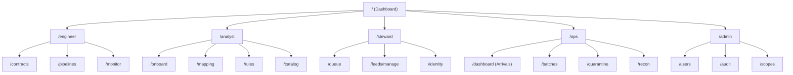
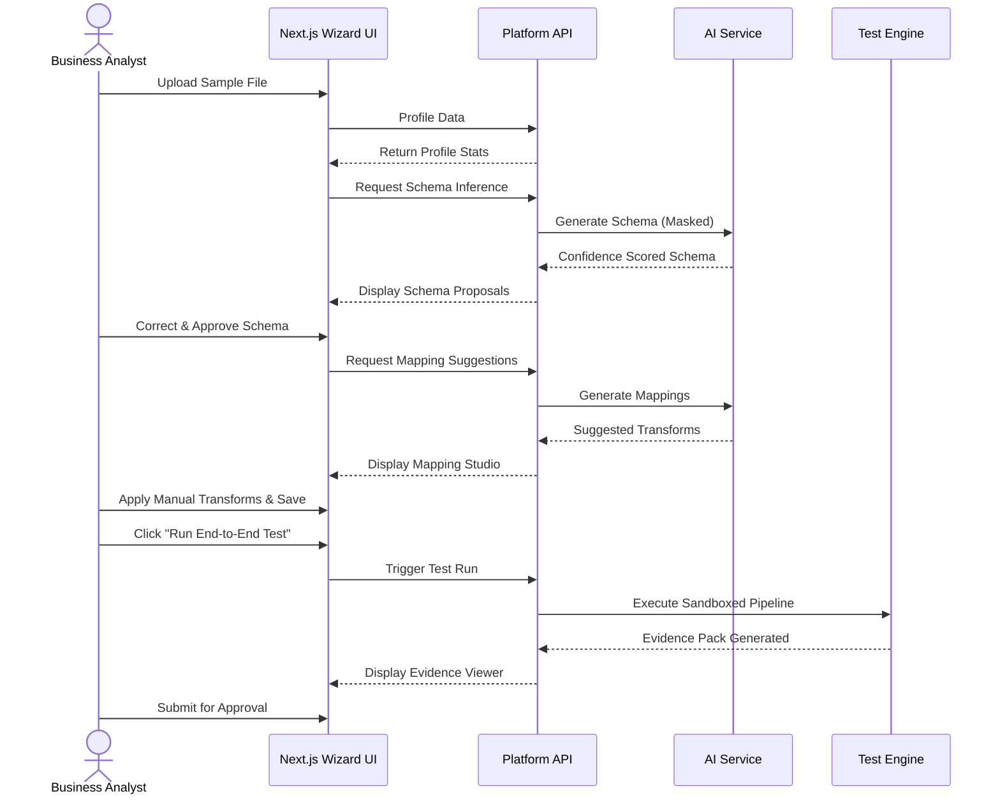
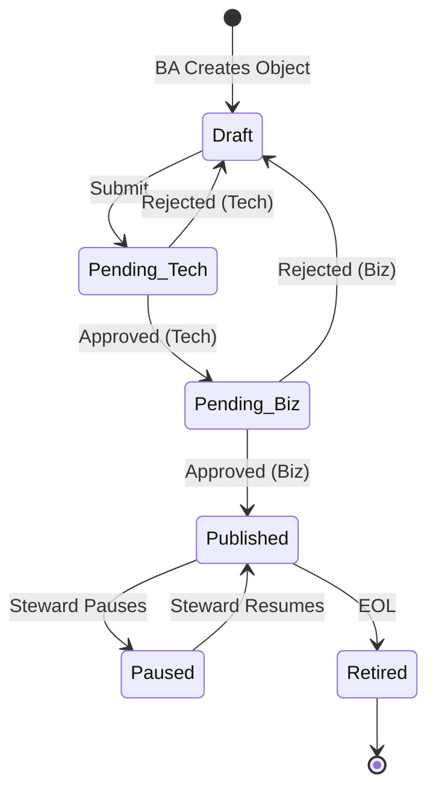
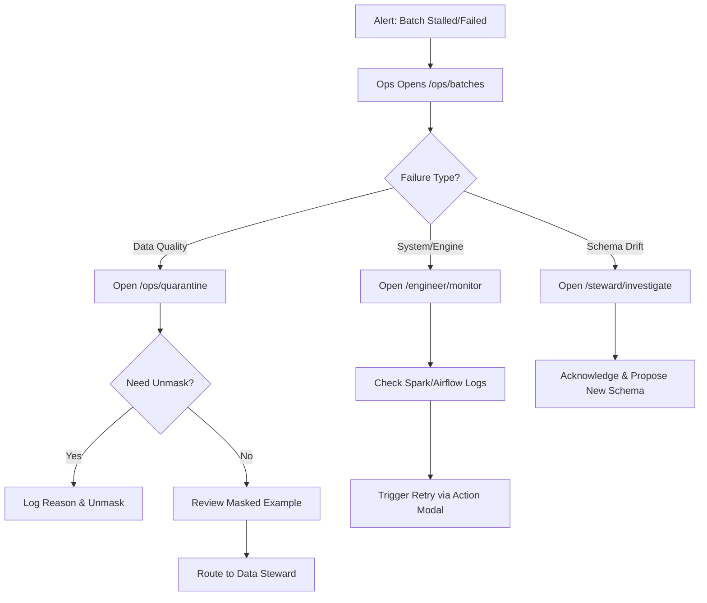

# CINQFLOW UI Architecture Design

> [!NOTE]
> This document outlines the Next.js 14 (App Router) based frontend architecture for CINQFLOW, utilizing TypeScript, Tailwind CSS, and shadcn/ui. 

## 1. Application Shell & Navigation Structure

The application shell provides the foundational layout and cross-cutting concerns:
- **Global Header**: Context switcher (Domain/Environment), Global Search (cmd+k), Notification Bell, User Profile & Role Indicator.
- **Sidebar Navigation**: Collapsible, role-driven navigation tree. Groups items by domain (e.g., Governance, Operations, Configuration).
- **Context Bar**: Below header, shows active feed, environment (DEV/PROD), and breadcrumbs.
- **Persistent Footer**: System status indicator, wave/version number, and help links.

## 2. Shared Architecture & Patterns

### Shared Components
- **Data Tables**: Built on `@tanstack/react-table`. Support server-side pagination, sorting, filtering, column visibility, and row selection.
- **Forms**: Built with `react-hook-form` and `zod` for validation. Include autosave and dirty-state tracking.
- **Status Badges**: Standardized semantic colors for lifecycles (Draft = Gray, Pending Review = Amber, Active = Green, Paused = Orange, Retired = Red, Quarantined = Crimson).
- **Lifecycle Indicators**: Stepper components showing object progression (e.g., Onboarding Wizard steps).
- **Diff Viewers**: Side-by-side and unified plain-language comparison for configuration changes.
- **Audit Panels**: Slide-out panels available on any entity showing "Who did what, when".

### Notification System
- **Toast Notifications**: For immediate, transient feedback (success/error).
- **Inbox Center**: Persistent drawer for alerts, pending approvals, and mentions.
- **Delivery Preferences**: Configurable per-user (In-app, Email, Slack/Teams).

### Real-time Update Approach
- **Server-Sent Events (SSE)**: Used for batch progress, pipeline monitor, and quarantine counts to push lightweight state changes without polling.
- **WebSockets**: Reserved for high-frequency interactive features if needed later, but SSE is primary for Wave 0-2 observability.

### Error Handling UX Patterns
- **Form-level**: Inline field validation errors with clear remediation text.
- **Boundary-level**: React Error Boundaries per route segment. Fallback UI explains the error without stack traces and offers a retry button.
- **Global-level**: 404/403/500 custom pages. 403 clearly states missing scope/role.

### Loading/Skeleton States
- **Skeletons**: shadcn `Skeleton` components mirroring the layout of the final content to prevent cumulative layout shift (CLS).
- **Transitions**: React `useTransition` for smooth state updates during client-side navigation.

### Mobile/Responsive Considerations
- Primary target is desktop (min-width 1024px) given the density of data (tables, mapping tools).
- Mobile views degrade gracefully: sidebars become hamburger menus, wide tables use horizontal scroll, but complex editors (Mapping Studio) will show a "Desktop Recommended" splash.

### Accessibility Requirements
- **WCAG 2.1 AA** compliance.
- Keyboard navigability for all interactive elements.
- ARIA attributes for dynamic content (alerts, progress bars).
- Sufficient color contrast for status indicators (not relying on color alone).

### Theming Approach
- CSS Variables via Tailwind for brand alignment.
- Dark/Light mode toggle supported out of the box using `next-themes`.

---

## 3. Personas and Screens

### Persona 1: Data Engineer
**Primary Focus**: Platform mechanics, pipeline configuration, and canonical deployment.

#### 1. Contract Register
1. **Screen Name & URL**: Contract Register (`/engineer/contracts/register`)
2. **Wave**: 0
3. **Primary Persona**: Data Engineer
4. **Purpose**: Track platform assumptions and reads/writes per story.
5. **Key UI Components**: Data Table with grouped risk views, Status Badges for Unconfirmed/Confirmed.
6. **Data Sources**: `GET /api/v1/contracts`, `POST /api/v1/contracts`
7. **User Actions**: Add entry, confirm unknown, view dependencies.
8. **Access Control**: Engineer role required.
9. **PHI Handling**: N/A (metadata only).
10. **Performance**: Load in < 1s.

#### 2. Feed Registry (Minimal)
1. **Screen Name & URL**: Engine Feed Config (`/engineer/feeds/minimal`)
2. **Wave**: 0
3. **Primary Persona**: Data Engineer
4. **Purpose**: Describe feed for engine execution (domain, format, pattern).
5. **Key UI Components**: Form with regex validator, test pattern input.
6. **Data Sources**: `GET /api/v1/feeds/minimal`, `PUT /api/v1/feeds/{id}`
7. **User Actions**: Create/Edit minimal feed.
8. **Access Control**: Engineer role required.
9. **PHI Handling**: N/A.
10. **Performance**: Pattern validation < 500ms.

#### 3. Schema Contract Management
1. **Screen Name & URL**: Schema Contracts (`/engineer/schema`)
2. **Wave**: 2
3. **Primary Persona**: Data Engineer
4. **Purpose**: View and manage technical schema drift and versioning.
5. **Key UI Components**: Diff Viewer, JSON Schema editor.
6. **Data Sources**: `GET /api/v1/schemas`
7. **User Actions**: Review drift alerts, propose technical fix.
8. **Access Control**: Engineer role required.
9. **PHI Handling**: Field names visible, data values masked.
10. **Performance**: Load in < 2s.

#### 4. Pipeline Configuration
1. **Screen Name & URL**: Pipeline Config (`/engineer/pipelines`)
2. **Wave**: 0
3. **Primary Persona**: Data Engineer
4. **Purpose**: Configure execution steps and compute resources.
5. **Key UI Components**: DAG Visualizer, form inputs for Spark/Airflow params.
6. **Data Sources**: `GET /api/v1/pipelines`
7. **User Actions**: Edit pipeline stages.
8. **Access Control**: Engineer role required.
9. **PHI Handling**: N/A.
10. **Performance**: DAG render < 1s.

#### 5. Pipeline Monitor (Technical View)
1. **Screen Name & URL**: Pipeline Monitor (`/engineer/monitor`)
2. **Wave**: 0
3. **Primary Persona**: Data Engineer
4. **Purpose**: Deep technical observability into DAG execution.
5. **Key UI Components**: Real-time log viewer, Gantt chart of stage execution.
6. **Data Sources**: `GET /api/v1/monitor/runs` (SSE)
7. **User Actions**: View logs, cancel technical run.
8. **Access Control**: Engineer role required.
9. **PHI Handling**: Logs scrubbed of PHI server-side.
10. **Performance**: SSE updates < 200ms latency.

#### 6. Schedule and Dependency Management
1. **Screen Name & URL**: Dependency Graph (`/engineer/dependencies`)
2. **Wave**: 1
3. **Primary Persona**: Data Engineer
4. **Purpose**: View upstream/downstream job links.
5. **Key UI Components**: Interactive Graph Node viewer.
6. **Data Sources**: `GET /api/v1/dependencies`
7. **User Actions**: Edit cron strings, link jobs.
8. **Access Control**: Engineer role required.
9. **PHI Handling**: N/A.
10. **Performance**: Node expansion < 1s.

#### 7. Canonical Model Management
1. **Screen Name & URL**: Canonical Models (`/engineer/canonical`)
2. **Wave**: 3
3. **Primary Persona**: Data Engineer
4. **Purpose**: Deploy ODS structural changes.
5. **Key UI Components**: DDL viewer, deployment history table.
6. **Data Sources**: `GET /api/v1/canonical/ddl`
7. **User Actions**: View DDL, trigger deployment.
8. **Access Control**: Engineer role required.
9. **PHI Handling**: N/A.
10. **Performance**: Load in < 2s.

#### 8. Configuration Promotion
1. **Screen Name & URL**: Promotion Center (`/engineer/promotions`)
2. **Wave**: 0
3. **Primary Persona**: Data Engineer
4. **Purpose**: Move approved config DEV -> PROD.
5. **Key UI Components**: Diff Viewer, checklist, promote button.
6. **Data Sources**: `POST /api/v1/promotions`
7. **User Actions**: Promote configuration.
8. **Access Control**: Engineer role (with promotion scope).
9. **PHI Handling**: N/A.
10. **Performance**: Promotion action < 5s.

---

### Persona 2: Business Analyst
**Primary Focus**: Onboarding feeds, mapping, and defining rules in business terms.

#### 1. Five-Step Onboarding Wizard
1. **Screen Name & URL**: Onboarding Wizard (`/analyst/onboard/{id}`)
2. **Wave**: 1
3. **Primary Persona**: Business Analyst
4. **Purpose**: Guided flow: Upload → Schema → Map → Rules → Publish.
5. **Key UI Components**: Stepper, File Uploader, inline editors, summary panel.
6. **Data Sources**: `GET /api/v1/onboarding/{id}`, `PUT /api/v1/onboarding/{id}/step`
7. **User Actions**: Upload file, confirm AI suggestions, run tests.
8. **Access Control**: BA role, scoped to specific domain/feed.
9. **PHI Handling**: All sample data uploaded is immediately governed. Displayed data masked unless explicitly unmasked.
10. **Performance**: AI suggestions returned < 10s.

#### 2. Full Source and Feed Registry
1. **Screen Name & URL**: Feed Registry (`/analyst/registry`)
2. **Wave**: 1
3. **Primary Persona**: Business Analyst
4. **Purpose**: Describe all business/technical details of a source/feed.
5. **Key UI Components**: Multi-section Form, search/filter table, clone button.
6. **Data Sources**: `GET /api/v1/registry/feeds`
7. **User Actions**: Create feed, clone feed, edit metadata.
8. **Access Control**: BA role.
9. **PHI Handling**: N/A.
10. **Performance**: Load in < 2s.

#### 3. Schema Profiler and Contract Editor
1. **Screen Name & URL**: Schema Studio (`/analyst/schema/{id}`)
2. **Wave**: 1
3. **Primary Persona**: Business Analyst
4. **Purpose**: Review profiler output and AI contract proposals.
5. **Key UI Components**: Data grid with column stats, confidence score badges, edit modals.
6. **Data Sources**: `GET /api/v1/schemas/{id}/profile`
7. **User Actions**: Accept/reject AI types, tag PHI.
8. **Access Control**: BA role.
9. **PHI Handling**: PHI fields tagged and masked visually in preview data.
10. **Performance**: Profile render < 2s.

#### 4. Mapping Studio
1. **Screen Name & URL**: Mapping Studio (`/analyst/mapping/{id}`)
2. **Wave**: 1
3. **Primary Persona**: Business Analyst
4. **Purpose**: Map source schema to canonical model.
5. **Key UI Components**: Split pane (Source / Target), drag-and-drop connectors (optional), function builder form.
6. **Data Sources**: `GET /api/v1/mappings/{id}`
7. **User Actions**: Accept AI mappings, write manual transforms (SPLIT, LOOKUP).
8. **Access Control**: BA role.
9. **PHI Handling**: Previews of data masked by default.
10. **Performance**: Instant validation of transform logic client-side.

#### 5. Rule Builder
1. **Screen Name & URL**: Rule Builder (`/analyst/rules/build`)
2. **Wave**: 1
3. **Primary Persona**: Business Analyst
4. **Purpose**: Define DQ rules via natural language or UI builder.
5. **Key UI Components**: NL input box, logical expression builder (AND/OR blocks).
6. **Data Sources**: `POST /api/v1/rules/draft`
7. **User Actions**: Create rule, set severity (Quarantine vs Alert).
8. **Access Control**: BA role.
9. **PHI Handling**: N/A for rule logic.
10. **Performance**: NL translation to logic < 3s.

#### 6. Rule Test Console
1. **Screen Name & URL**: Rule Tester (`/analyst/rules/test`)
2. **Wave**: 1
3. **Primary Persona**: Business Analyst
4. **Purpose**: Test rules against sample data sets.
5. **Key UI Components**: Data grid with pass/fail highlighting, metric summary.
6. **Data Sources**: `POST /api/v1/rules/test`
7. **User Actions**: Execute test, view hit rate.
8. **Access Control**: BA role.
9. **PHI Handling**: Data masked in failure examples.
10. **Performance**: Test execution < 5s.

#### 7. Canonical Model Browser
1. **Screen Name & URL**: Model Browser (`/analyst/canonical`)
2. **Wave**: 1
3. **Primary Persona**: Business Analyst
4. **Purpose**: View target models and business definitions.
5. **Key UI Components**: Tree view of domains/entities, detail panel with glossary links.
6. **Data Sources**: `GET /api/v1/canonical/model`
7. **User Actions**: Search fields, view lineage.
8. **Access Control**: BA role.
9. **PHI Handling**: N/A.
10. **Performance**: Search < 300ms.

#### 8. Business Glossary
1. **Screen Name & URL**: Glossary (`/analyst/glossary`)
2. **Wave**: 1
3. **Primary Persona**: Business Analyst
4. **Purpose**: Lookup approved business terms.
5. **Key UI Components**: Searchable list, term detail card.
6. **Data Sources**: `GET /api/v1/glossary`
7. **User Actions**: Browse terms.
8. **Access Control**: BA role.
9. **PHI Handling**: N/A.
10. **Performance**: Search < 300ms.

#### 9. Data Catalog
1. **Screen Name & URL**: Catalog (`/analyst/catalog`)
2. **Wave**: 4
3. **Primary Persona**: Business Analyst
4. **Purpose**: Discover available data products.
5. **Key UI Components**: Search interface, facet filters, data product cards.
6. **Data Sources**: `GET /api/v1/catalog`
7. **User Actions**: Search, view metadata.
8. **Access Control**: BA role.
9. **PHI Handling**: Metadata only.
10. **Performance**: Search < 500ms.

#### 10. Evidence Pack Viewer
1. **Screen Name & URL**: Evidence Viewer (`/analyst/evidence/{id}`)
2. **Wave**: 1
3. **Primary Persona**: Business Analyst
4. **Purpose**: View generated onboarding test results.
5. **Key UI Components**: Summary dashboard, before/after diffs, export button.
6. **Data Sources**: `GET /api/v1/evidence/{id}`
7. **User Actions**: View report, export PDF.
8. **Access Control**: BA role.
9. **PHI Handling**: All output heavily masked.
10. **Performance**: Load in < 2s.

---

### Persona 3: Data Steward
**Primary Focus**: Governance, review, approvals, and exception management.

#### 1. Work Queue
1. **Screen Name & URL**: Work Queue (`/steward/queue`)
2. **Wave**: 1
3. **Primary Persona**: Data Steward
4. **Purpose**: Central inbox for all items pending review.
5. **Key UI Components**: Unified inbox list, filters (Schema, Mapping, Rules).
6. **Data Sources**: `GET /api/v1/tasks/pending`
7. **User Actions**: Claim task, open review.
8. **Access Control**: Steward role.
9. **PHI Handling**: N/A.
10. **Performance**: Load in < 1s.

#### 2. Schema Contract Review
1. **Screen Name & URL**: Schema Review (`/steward/review/schema/{id}`)
2. **Wave**: 1
3. **Primary Persona**: Data Steward
4. **Purpose**: Approve or reject schema contracts.
5. **Key UI Components**: Diff viewer against previous version, PHI flag auditor.
6. **Data Sources**: `GET /api/v1/schemas/{id}/draft`
7. **User Actions**: Approve, Reject with comment.
8. **Access Control**: Steward role. Server verifies Steward is != Author.
9. **PHI Handling**: Shows PHI classifications clearly.
10. **Performance**: Load in < 1s.

#### 3. Mapping Review with Impact Analysis
1. **Screen Name & URL**: Mapping Review (`/steward/review/mapping/{id}`)
2. **Wave**: 1
3. **Primary Persona**: Data Steward
4. **Purpose**: Review mappings and blast radius.
5. **Key UI Components**: Side-by-side mapping diff, Impact graph (downstream dependencies).
6. **Data Sources**: `GET /api/v1/mappings/{id}/impact`
7. **User Actions**: Approve, Reject.
8. **Access Control**: Steward role, not Author.
9. **PHI Handling**: Previews masked.
10. **Performance**: Impact graph render < 2s.

#### 4. Rule Review with Severity Configuration
1. **Screen Name & URL**: Rule Review (`/steward/review/rules/{id}`)
2. **Wave**: 1
3. **Primary Persona**: Data Steward
4. **Purpose**: Review DQ rules and enforce severity standards.
5. **Key UI Components**: Rule logic viewer, test result summary.
6. **Data Sources**: `GET /api/v1/rules/{id}/draft`
7. **User Actions**: Approve, Reject, adjust severity.
8. **Access Control**: Steward role, not Author.
9. **PHI Handling**: N/A.
10. **Performance**: Load in < 1s.

#### 5. Feed Lifecycle Management
1. **Screen Name & URL**: Feed Lifecycle (`/steward/feeds/manage`)
2. **Wave**: 1
3. **Primary Persona**: Data Steward
4. **Purpose**: Transition feed states (Draft -> Active -> Paused -> Retired).
5. **Key UI Components**: State machine diagram, action buttons.
6. **Data Sources**: `POST /api/v1/feeds/{id}/state`
7. **User Actions**: Change state with audit reason.
8. **Access Control**: Steward role.
9. **PHI Handling**: N/A.
10. **Performance**: State change < 1s.

#### 6. Glossary Management
1. **Screen Name & URL**: Glossary Admin (`/steward/glossary/manage`)
2. **Wave**: 1
3. **Primary Persona**: Data Steward
4. **Purpose**: Maintain business terms and tags.
5. **Key UI Components**: CRUD table, term editor.
6. **Data Sources**: `PUT /api/v1/glossary/{id}`
7. **User Actions**: Add/Edit/Deprecate terms.
8. **Access Control**: Steward role.
9. **PHI Handling**: N/A.
10. **Performance**: Update < 1s.

#### 7. Identity Exception Queue
1. **Screen Name & URL**: ID Exceptions (`/steward/identity/exceptions`)
2. **Wave**: 3
3. **Primary Persona**: Data Steward
4. **Purpose**: Resolve uncertain identity matches.
5. **Key UI Components**: List of ambiguous records, match score indicators.
6. **Data Sources**: `GET /api/v1/identity/exceptions`
7. **User Actions**: Open decision card.
8. **Access Control**: Steward role with unmask rights.
9. **PHI Handling**: Masked by default, explicitly unmasked for decision.
10. **Performance**: Load in < 2s.

#### 8. Merge/Split Decision Cards
1. **Screen Name & URL**: Merge/Split (`/steward/identity/decision/{id}`)
2. **Wave**: 3
3. **Primary Persona**: Data Steward
4. **Purpose**: Manually merge or split member records.
5. **Key UI Components**: Side-by-side attribute comparison card.
6. **Data Sources**: `POST /api/v1/identity/decision`
7. **User Actions**: Confirm merge, force split.
8. **Access Control**: Steward role.
9. **PHI Handling**: Explicitly unmasked with audit log entry.
10. **Performance**: Submit < 1s.

#### 9. Variance Investigation
1. **Screen Name & URL**: Variance Board (`/steward/investigate`)
2. **Wave**: 2
3. **Primary Persona**: Data Steward
4. **Purpose**: Investigate anomalous feed behaviors or drift.
5. **Key UI Components**: Trend charts, anomaly flags, comment threads.
6. **Data Sources**: `GET /api/v1/observability/variances`
7. **User Actions**: Acknowledge, dismiss, create ticket.
8. **Access Control**: Steward role.
9. **PHI Handling**: N/A.
10. **Performance**: Chart render < 2s.

#### 10. Knowledge Base Management
1. **Screen Name & URL**: KB Admin (`/steward/kb`)
2. **Wave**: 4
3. **Primary Persona**: Data Steward
4. **Purpose**: Curate templates and Copilot knowledge.
5. **Key UI Components**: Markdown editor, template manager.
6. **Data Sources**: `PUT /api/v1/kb/{id}`
7. **User Actions**: Edit articles, approve templates.
8. **Access Control**: Steward role.
9. **PHI Handling**: N/A.
10. **Performance**: Save < 1s.

---

### Persona 4: Operations
**Primary Focus**: Run state, SLA monitoring, and incident triage.

#### 1. Operations Home / File-Arrival Board
1. **Screen Name & URL**: Ops Home (`/ops/dashboard`)
2. **Wave**: 2
3. **Primary Persona**: Operations
4. **Purpose**: Macro view of SLA status and arrivals.
5. **Key UI Components**: SLA countdown timers, Arrival grid (Expected vs Actual).
6. **Data Sources**: `GET /api/v1/ops/arrivals` (SSE)
7. **User Actions**: Click to view batch details.
8. **Access Control**: Operations role.
9. **PHI Handling**: N/A.
10. **Performance**: SSE updates < 200ms.

#### 2. Batch and Stage Monitor
1. **Screen Name & URL**: Batch Monitor (`/ops/batches`)
2. **Wave**: 2
3. **Primary Persona**: Operations
4. **Purpose**: Track files through Landing -> Bronze -> Silver.
5. **Key UI Components**: Kanban-style stage board, progress bars.
6. **Data Sources**: `GET /api/v1/ops/batches` (SSE)
7. **User Actions**: View details, filter by status.
8. **Access Control**: Operations role.
9. **PHI Handling**: N/A.
10. **Performance**: Load in < 1s.

#### 3. Governed Action Surface
1. **Screen Name & URL**: Actions Modal (Global overlay)
2. **Wave**: 2
3. **Primary Persona**: Operations
4. **Purpose**: Safely interact with stalled/failed batches.
5. **Key UI Components**: Action dropdown (Pause, Retry, Acknowledge), reason input.
6. **Data Sources**: `POST /api/v1/ops/actions`
7. **User Actions**: Execute governed action.
8. **Access Control**: Operations role.
9. **PHI Handling**: N/A.
10. **Performance**: Execution < 2s.

#### 4. Quarantine Viewer
1. **Screen Name & URL**: Quarantine (`/ops/quarantine`)
2. **Wave**: 2
3. **Primary Persona**: Operations
4. **Purpose**: View records that failed DQ/schema rules.
5. **Key UI Components**: Data grid, rule failure reason panel.
6. **Data Sources**: `GET /api/v1/ops/quarantine`
7. **User Actions**: View failures, request unmasking.
8. **Access Control**: Operations role.
9. **PHI Handling**: Data is masked. Explicit reason required to unmask for triage.
10. **Performance**: Load in < 2s.

#### 5. Reconciliation Dashboard
1. **Screen Name & URL**: Recon Board (`/ops/recon`)
2. **Wave**: 2
3. **Primary Persona**: Operations
4. **Purpose**: View row-count balances (In == Loaded + Quarantined).
5. **Key UI Components**: Ledger UI, variance indicators (red if unbalanced).
6. **Data Sources**: `GET /api/v1/ops/recon`
7. **User Actions**: Export report.
8. **Access Control**: Operations role.
9. **PHI Handling**: Counts only.
10. **Performance**: Load in < 2s.

#### 6. Certification Viewer
1. **Screen Name & URL**: Certification (`/ops/certs`)
2. **Wave**: 2
3. **Primary Persona**: Operations
4. **Purpose**: View batch certifications for downstream use.
5. **Key UI Components**: Digital certificate card UI, signature details.
6. **Data Sources**: `GET /api/v1/ops/certs`
7. **User Actions**: View cert, revoke (if error found late).
8. **Access Control**: Operations role.
9. **PHI Handling**: N/A.
10. **Performance**: Load in < 1s.

#### 7. Feed Reliability Trends
1. **Screen Name & URL**: Reliability (`/ops/reliability`)
2. **Wave**: 2
3. **Primary Persona**: Operations
4. **Purpose**: Long-term health metrics per feed.
5. **Key UI Components**: Time-series charts, SLA hit/miss ratios.
6. **Data Sources**: `GET /api/v1/ops/metrics`
7. **User Actions**: Filter by date/feed.
8. **Access Control**: Operations role.
9. **PHI Handling**: N/A.
10. **Performance**: Chart data < 3s.

#### 8. Alert Inbox
1. **Screen Name & URL**: Alerts (`/ops/alerts`)
2. **Wave**: 2
3. **Primary Persona**: Operations
4. **Purpose**: Centralized alert management.
5. **Key UI Components**: Inbox list, severity badges.
6. **Data Sources**: `GET /api/v1/alerts`
7. **User Actions**: Dismiss, link to incident.
8. **Access Control**: Operations role.
9. **PHI Handling**: Alert text scrubbed.
10. **Performance**: Load < 1s.

#### 9. Incident Management
1. **Screen Name & URL**: Incidents (`/ops/incidents`)
2. **Wave**: 2
3. **Primary Persona**: Operations
4. **Purpose**: Track larger platform issues.
5. **Key UI Components**: Ticket viewer, timeline.
6. **Data Sources**: `GET /api/v1/incidents`
7. **User Actions**: Update status, add notes.
8. **Access Control**: Operations role.
9. **PHI Handling**: N/A.
10. **Performance**: Load < 1s.

#### 10. Recovery Operations
1. **Screen Name & URL**: Recovery (`/ops/recovery`)
2. **Wave**: 2
3. **Primary Persona**: Operations
4. **Purpose**: Backdate or replay batches.
5. **Key UI Components**: Date selector, targeted run configuration form.
6. **Data Sources**: `POST /api/v1/ops/recover`
7. **User Actions**: Execute replay.
8. **Access Control**: Operations role (elevated).
9. **PHI Handling**: N/A.
10. **Performance**: Submission < 2s.

#### 11. Migration Wave Register
1. **Screen Name & URL**: Wave Register (`/ops/migration`)
2. **Wave**: 5
3. **Primary Persona**: Operations
4. **Purpose**: Track cutover status of feeds.
5. **Key UI Components**: Status board, checklist.
6. **Data Sources**: `GET /api/v1/migration/waves`
7. **User Actions**: Update wave status.
8. **Access Control**: Operations role.
9. **PHI Handling**: N/A.
10. **Performance**: Load < 2s.

#### 12. Identity Reconciliation Telemetry
1. **Screen Name & URL**: ID Telemetry (`/ops/identity-metrics`)
2. **Wave**: 3
3. **Primary Persona**: Operations
4. **Purpose**: Monitor ID resolution engine performance.
5. **Key UI Components**: Throughput graphs, match rate gauges.
6. **Data Sources**: `GET /api/v1/identity/metrics`
7. **User Actions**: View stats.
8. **Access Control**: Operations role.
9. **PHI Handling**: N/A (aggregate stats).
10. **Performance**: Load < 2s.

---

### Persona 5: Approver
**Primary Focus**: Authorizing high-stakes changes.

#### 1. Approval Queue with Evidence Packets
1. **Screen Name & URL**: Approval Queue (`/approver/queue`)
2. **Wave**: 1
3. **Primary Persona**: Approver
4. **Purpose**: Central location for reviewing deployment/onboarding requests.
5. **Key UI Components**: List view, rich Document Viewer for Evidence Packs.
6. **Data Sources**: `GET /api/v1/approvals/pending`
7. **User Actions**: Approve, Reject, Request Info.
8. **Access Control**: Approver role. Cannot approve own requests.
9. **PHI Handling**: Evidence packs are pre-scrubbed.
10. **Performance**: Load < 1s.

#### 2. Impact Analysis Views
1. **Screen Name & URL**: Impact Viewer (`/approver/impact/{id}`)
2. **Wave**: 1
3. **Primary Persona**: Approver
4. **Purpose**: Understand blast radius before approving.
5. **Key UI Components**: Dependency tree, risk score indicator.
6. **Data Sources**: `GET /api/v1/approvals/{id}/impact`
7. **User Actions**: View risk assessment.
8. **Access Control**: Approver role.
9. **PHI Handling**: N/A.
10. **Performance**: Render < 2s.

#### 3. Cutover Approval
1. **Screen Name & URL**: Cutover Signoff (`/approver/cutover/{id}`)
2. **Wave**: 5
3. **Primary Persona**: Approver
4. **Purpose**: Authorize final production cutover.
5. **Key UI Components**: Checklist, parallel-run reconciliation summary.
6. **Data Sources**: `POST /api/v1/approvals/cutover`
7. **User Actions**: Sign off cutover.
8. **Access Control**: Approver role (Leadership).
9. **PHI Handling**: N/A.
10. **Performance**: Action < 2s.

---

### Persona 6: Administrator
**Primary Focus**: Security, auditing, and system health.

#### 1. User and Role Management
1. **Screen Name & URL**: User Admin (`/admin/users`)
2. **Wave**: 0
3. **Primary Persona**: Administrator
4. **Purpose**: Manage AD sync and group mappings.
5. **Key UI Components**: Data table, role assignment modal.
6. **Data Sources**: `GET /api/v1/admin/users`, `PUT /api/v1/admin/roles`
7. **User Actions**: Assign roles.
8. **Access Control**: Admin role.
9. **PHI Handling**: N/A.
10. **Performance**: Load < 2s.

#### 2. Scope Management
1. **Screen Name & URL**: Scopes (`/admin/scopes`)
2. **Wave**: 4
3. **Primary Persona**: Administrator
4. **Purpose**: Define data access boundaries (Domain, Env).
5. **Key UI Components**: Matrix grid (User vs Domain).
6. **Data Sources**: `PUT /api/v1/admin/scopes`
7. **User Actions**: Edit access matrix.
8. **Access Control**: Admin role.
9. **PHI Handling**: N/A.
10. **Performance**: Save < 1s.

#### 3. Access Review Campaigns
1. **Screen Name & URL**: Access Campaigns (`/admin/campaigns`)
2. **Wave**: 4
3. **Primary Persona**: Administrator
4. **Purpose**: Conduct quarterly access attestations.
5. **Key UI Components**: Campaign tracker, reporting dashboard.
6. **Data Sources**: `POST /api/v1/admin/campaigns`
7. **User Actions**: Launch campaign, view progress.
8. **Access Control**: Admin role.
9. **PHI Handling**: N/A.
10. **Performance**: Load < 2s.

#### 4. Emergency Access Management
1. **Screen Name & URL**: Break Glass (`/admin/break-glass`)
2. **Wave**: 4
3. **Primary Persona**: Administrator
4. **Purpose**: Manage elevated temporary access.
5. **Key UI Components**: Active sessions list, force-revoke button, request form.
6. **Data Sources**: `POST /api/v1/admin/emergency`
7. **User Actions**: Grant access, revoke access.
8. **Access Control**: Admin role.
9. **PHI Handling**: N/A.
10. **Performance**: Grant < 1s (instant).

#### 5. Release Management
1. **Screen Name & URL**: Releases (`/admin/releases`)
2. **Wave**: 4
3. **Primary Persona**: Administrator
4. **Purpose**: Coordinate platform config deployments.
5. **Key UI Components**: Release manifest viewer.
6. **Data Sources**: `GET /api/v1/admin/releases`
7. **User Actions**: Block release, view manifest.
8. **Access Control**: Admin role.
9. **PHI Handling**: N/A.
10. **Performance**: Load < 1s.

#### 6. Freeze Window Management
1. **Screen Name & URL**: Freeze Windows (`/admin/freezes`)
2. **Wave**: 4
3. **Primary Persona**: Administrator
4. **Purpose**: Prevent changes during critical periods.
5. **Key UI Components**: Calendar view, form.
6. **Data Sources**: `POST /api/v1/admin/freezes`
7. **User Actions**: Schedule freeze.
8. **Access Control**: Admin role.
9. **PHI Handling**: N/A.
10. **Performance**: Save < 1s.

#### 7. Audit Trail Search
1. **Screen Name & URL**: Audit Logs (`/admin/audit`)
2. **Wave**: 4
3. **Primary Persona**: Administrator
4. **Purpose**: Search immutable system actions.
5. **Key UI Components**: Advanced search bar, immutable log table.
6. **Data Sources**: `GET /api/v1/admin/audit`
7. **User Actions**: Search, export logs.
8. **Access Control**: Admin role.
9. **PHI Handling**: PHI unmasking events explicitly logged here.
10. **Performance**: Search over 10M rows < 3s (backend indexed).

#### 8. System Health Dashboard
1. **Screen Name & URL**: Health (`/admin/health`)
2. **Wave**: 0
3. **Primary Persona**: Administrator
4. **Purpose**: Platform infrastructure health.
5. **Key UI Components**: Status indicator lights (DB, Compute, AI Service).
6. **Data Sources**: `GET /api/v1/admin/health`
7. **User Actions**: View status.
8. **Access Control**: Admin role.
9. **PHI Handling**: N/A.
10. **Performance**: Load < 1s.

#### 9. Platform Configuration
1. **Screen Name & URL**: Config (`/admin/settings`)
2. **Wave**: 4
3. **Primary Persona**: Administrator
4. **Purpose**: Global settings (Timeouts, Integrations).
5. **Key UI Components**: Settings form.
6. **Data Sources**: `PUT /api/v1/admin/settings`
7. **User Actions**: Edit settings.
8. **Access Control**: Admin role.
9. **PHI Handling**: N/A.
10. **Performance**: Save < 1s.

#### 10. Ownership Transfer Dashboard
1. **Screen Name & URL**: Transfer (`/admin/transfer`)
2. **Wave**: 5
3. **Primary Persona**: Administrator
4. **Purpose**: Manage handoff from implementation to BAU team.
5. **Key UI Components**: Progress tracker, sign-off buttons.
6. **Data Sources**: `POST /api/v1/admin/transfer`
7. **User Actions**: Execute handoff.
8. **Access Control**: Admin role.
9. **PHI Handling**: N/A.
10. **Performance**: Load < 2s.

---

### Persona 7: Read-Only
**Primary Focus**: Visibility without mutation.

- **Screens**: Can view all screens their domain/environment scope permits.
- **Rules**: 
  - No mutation controls (Save, Delete, Approve, Promote, Pause) are rendered in the DOM.
  - Every API call performing mutation (POST/PUT/DELETE) is intercepted at the edge/middleware and returns `403 Forbidden`.
  - Can view dashboards, metrics, and search read-only configurations.

---

## 4. Mermaid Diagrams

### 1. Navigation Sitemap

### 2. Onboarding Wizard Flow (BA Persona)

### 3. Approval Flow

### 4. Operations Triage Flow

