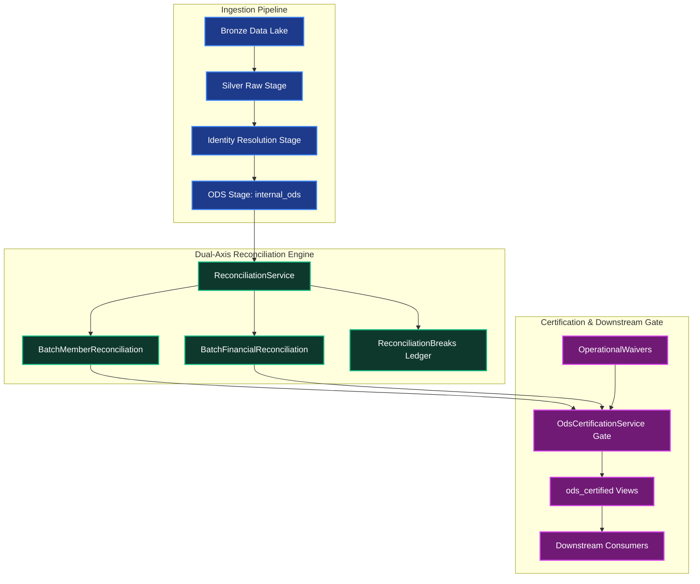

# WAVE 3 SLICE 6 IMPLEMENTATION PLAN
## Story: CF-V3-E13-02 — Financial and Member Reconciliation

---

## 1. Executive Summary
This document establishes the definitive, implementation-ready architectural plan for **Wave 3 Slice 6: CF-V3-E13-02 (Financial and Member Reconciliation)** in the CINQFLOW healthcare data management platform.

Following the formal acceptance of Wave 3 Slice 5 (`CF-V3-E10-03`), the platform guarantees governed ODS certification and downstream consumer compatibility. However, downstream consumers cannot safely consume certified data if reconciliation is limited to Wave 0 row counts (`rows_in = rows_silver + rows_quarantined`). In healthcare claims and member enrollment processing, batches may maintain perfect row counts while suffering financial truncation, line-item dropping, or unrecorded member loss during survivorship and identity resolution.

**CF-V3-E13-02** solves this by establishing dual-axis mathematical parity:
1. **Member Count Parity**: Source input member count vs canonical ODS members (`internal_ods.ods_members_v1`), accounting for duplicate members merged via survivorship (`internal_ods.ods_member_provenance_v1`), quarantine rejections, and explicit drops, mathematically proving zero unexplained member loss.
2. **Financial Parity**: Source input claim total dollar amounts vs canonical ODS claims (`internal_ods.ods_claims_v1.total_charge_amount`) and line items (`internal_ods.ods_claim_lines_v1.allowed_amount`), enforcing configurable tolerance bounds (default: strict `$0.00` variance).
3. **ODS Certification Integration**: Upgrades `OdsCertificationService.evaluate_batch_eligibility` to assert that both member and financial parity pass (or carry active, governed operational waivers) prior to issuing certification.

---

## 2. Repository Inspection Findings

Direct codebase inspection revealed the following concrete architectural facts:

### Backend Architecture
- **Existing Reconciliation Model** (`backend/models/reconciliation.py`):
  - Contains `BatchReconciliation` and `ReconciliationLedgerEntry`.
  - Currently evaluates only row-count balance: `rows_in == (rows_silver_raw + rows_quarantined + rows_dropped)`.
  - Has `ReconciliationStatusEnum`: `PASS`, `FAIL`, `PENDING`.
  - Has `discrepancy: Mapped[int]`.
- **Existing Batch Model** (`backend/models/pipeline.py`):
  - `Batch` defines `status` (`BatchStatusEnum`: `PENDING`, `RUNNING`, `SUCCESS`, `FAILED`, `FAILED_RECONCILIATION`, `CANCELLED`).
  - Has `reconciliation = relationship("BatchReconciliation", uselist=False)`.
  - `BatchReconciliation.batch_id` has `ForeignKey("batches.id", ondelete="CASCADE")`.
- **Existing Reconciliation Service** (`backend/services/reconciliation_service.py`):
  - Currently 0 bytes (an empty stub). All Wave 0 row-count reconciliation is embedded in `backend/engine/executor.py` (`_compute_reconciliation`).
- **Pipeline Executor** (`backend/engine/executor.py`):
  - Dispatches stages: `LANDING` -> `BRONZE` -> `SILVER_RAW` -> `IDENTITY` -> `ODS`.
  - After stage completion, calls `_compute_reconciliation(batch, context, actor_id, actor_email)` (lines 766-879).
  - When row-count balance fails, sets `batch.status = BatchStatusEnum.FAILED_RECONCILIATION`, emits `AuditActionEnum.RECONCILIATION_FAILED`, and calls `AlertService.record_failure(category=FailureCategoryEnum.RECONCILIATION)`.
- **ODS Writing & Certification**:
  - `internal_ods.ods_members_v1` (grain: `cinq_id, batch_id`), `internal_ods.ods_member_provenance_v1` (tracks `survivorship_winner: bool`), `internal_ods.ods_claims_v1` (`total_charge_amount: Numeric(14, 2)`), `internal_ods.ods_claim_lines_v1` (`allowed_amount: Numeric(14, 2)`).
  - `OdsCertificationService.evaluate_batch_eligibility` (Slice 5) checks `batch.reconciliation`, but currently only checks row count `balance_check_passed`.
- **Existing Waiver Mechanism** (`backend/models/governance.py` & `backend/services/variance_waiver_service.py`):
  - `OperationalWaiver` model exists with `affected_control_type` (e.g. `RECONCILIATION`, `SCHEMA_DRIFT`, `DQ_RULE`), `affected_control_id`, `expires_at`, and `status == WaiverStatusEnum.APPROVED`.
  - `VarianceWaiverService.does_waiver_apply_to_batch` evaluates applicability by batch ID, batch range, or time window.

### Database Architecture
- Migration head is `024_ods_certification_and_consumer_gate`.
- PostgreSQL 16 Alpine container active on port 5432.
- Schemas: `public`, `internal_ods`, `ods_certified`.
- Triggers:
  - `trg_protect_ods_certification_transition` on `ods_certifications` (raises SQLSTATE `23514` on unauthorized UPDATE or any DELETE).
  - `trg_prevent_identity_merge_split_event_mutation` on `identity_merge_split_event` (raises SQLSTATE `23514`).
  - `trg_enforce_master_identity_status_transition` on `master_identities` (raises SQLSTATE `23514`).

### Frontend Architecture
- `frontend/app/reconciliation/page.tsx` displays Wave 0 row count balance in a single table with columns: Batch ID, Input Rows, Silver Raw, Quarantined, Dropped, Discrepancy, Balance Result.
- `frontend/app/batches/[id]/page.tsx` displays batch status, stage cards, and a summary reconciliation card showing row counts only.
- Authentication & RBAC: Token stored in `localStorage`, role extraction via `/api/v1/auth/me`.

---

## 3. Accepted Baseline

The implementation must maintain 100% green status on the verified baseline:
- **Test Suite**: 547 / 547 tests passing (0 failed, 0 errors, 0 skipped, 0 xfailed) across 72 test modules.
- **Database**: PostgreSQL 16 Alpine running on port 5432.
- **Alembic Revision**: `024_ods_certification_and_consumer_gate`.
- **Backend Compilation**: Clean compilation (`python -m compileall backend database tests`).
- **Frontend Build**: Next.js production build passing with 16 routes.
- **Database Constraints & Protection**: 17 / 17 checks passing.

Regression testing will be executed after every phase of implementation to ensure the baseline remains fully intact.

---

## 4. Exact Story Scope (CF-V3-E13-02)

1. **Member Count Parity**:
   - Source member count vs canonical ODS member count (`internal_ods.ods_members_v1`).
   - Survivorship deduplication tracking (`internal_ods.ods_member_provenance_v1` where `survivorship_winner = false`).
   - Quarantine drops (`quarantine_records`).
   - Discrepancy calculation: `discrepancy = members_in - (members_ods + survivorship_dropped + quarantined + dropped)`.
   - Balanced condition: `discrepancy == 0`.
2. **Financial Parity**:
   - Source claim total amount vs canonical ODS claim total amount (`internal_ods.ods_claims_v1.total_charge_amount`).
   - Canonical ODS claim total amount vs canonical ODS line item total amount (`internal_ods.ods_claim_lines_v1.allowed_amount`).
   - Configurable tolerance threshold (default: `$0.00`).
   - Status evaluation: `PASS`, `FAIL`, `TOLERANCE_EXCEEDED`.
3. **Feed Contract Awareness**:
   - `MEMBERS_ONLY`: evaluates member parity; skips financial parity.
   - `CLAIMS_ONLY`: evaluates financial parity; skips member parity.
   - `COMBINED`: evaluates both member and financial parity.
4. **Reconciliation Break Ledger**:
   - Fine-grained ledger entries for discrepancies (`reconciliation_breaks`).
   - Zero-PHI enforcement: synthetic identifiers only (e.g. `row_1_a1b2c3d4`, claim UUIDs, or cryptographic hashes).
5. **ODS Certification Gate Integration**:
   - `OdsCertificationService.evaluate_batch_eligibility` requires both member and financial parity to pass (or be waived under active `OperationalWaiver`).
6. **Failure Incident & Batch Lifecycle**:
   - Failed reconciliation transitions batch to `FAILED_RECONCILIATION` and emits `AlertService.record_failure(category=FailureCategoryEnum.RECONCILIATION)`.
7. **APIs & Frontend**:
   - Endpoints for batch financial/member reconciliation, breaks ledger, and recompute.
   - Multi-tab Reconciliation Dashboard and Batch Detail summary cards.

---

## 5. Out-of-Scope Confirmation

The following stories and components are strictly **EXCLUDED** from Slice 6:
- **CF-V3-E9-04** (*Identity Reconciliation and Cutover Telemetry*): Reserved for Wave 3 Slice 7.
- **UNK-012 Legacy SQL Server Integration**: Deferred to Wave 5 cutover.
- **Wave 4 Features**: Domain-scoped RBAC, PHI export masking, release management, AI Copilot.
- **Wave 5 Features**: Parallel-run enterprise cutover and legacy database decommissioning.

---

## 6. Existing Architecture Mapping



---

## 7. Database Design

### 7.1 New Entities

#### Table 1: `public.batch_financial_reconciliation`
Stores financial parity metrics for batches containing claims.
```sql
CREATE TABLE public.batch_financial_reconciliation (
    id UUID PRIMARY KEY DEFAULT gen_random_uuid(),
    batch_id UUID NOT NULL REFERENCES public.batches(id) ON DELETE CASCADE,
    total_claims_amount_in NUMERIC(14, 2) NOT NULL DEFAULT 0.00,
    total_claims_amount_ods NUMERIC(14, 2) NOT NULL DEFAULT 0.00,
    total_claim_lines_amount_ods NUMERIC(14, 2) NOT NULL DEFAULT 0.00,
    claims_amount_variance NUMERIC(14, 2) NOT NULL DEFAULT 0.00,
    claim_lines_amount_variance NUMERIC(14, 2) NOT NULL DEFAULT 0.00,
    tolerance_threshold NUMERIC(14, 2) NOT NULL DEFAULT 0.00,
    status VARCHAR(50) NOT NULL, -- 'PASS', 'FAIL', 'TOLERANCE_EXCEEDED'
    discrepancy_count INT NOT NULL DEFAULT 0,
    created_at TIMESTAMPTZ NOT NULL DEFAULT clock_timestamp(),
    created_by VARCHAR(255) NOT NULL,
    updated_at TIMESTAMPTZ NOT NULL DEFAULT clock_timestamp(),
    updated_by VARCHAR(255) NOT NULL,
    version INT NOT NULL DEFAULT 1,
    CONSTRAINT chk_financial_recon_status CHECK (status IN ('PASS', 'FAIL', 'TOLERANCE_EXCEEDED')),
    CONSTRAINT uq_financial_recon_batch UNIQUE (batch_id)
);
CREATE INDEX ix_financial_recon_batch_id ON public.batch_financial_reconciliation(batch_id);
CREATE INDEX ix_financial_recon_status ON public.batch_financial_reconciliation(status);
```

#### Table 2: `public.batch_member_reconciliation`
Stores member count parity metrics for batches containing members.
```sql
CREATE TABLE public.batch_member_reconciliation (
    id UUID PRIMARY KEY DEFAULT gen_random_uuid(),
    batch_id UUID NOT NULL REFERENCES public.batches(id) ON DELETE CASCADE,
    member_count_in INT NOT NULL DEFAULT 0,
    member_count_ods INT NOT NULL DEFAULT 0,
    survivorship_dropped_count INT NOT NULL DEFAULT 0,
    quarantined_count INT NOT NULL DEFAULT 0,
    dropped_count INT NOT NULL DEFAULT 0,
    discrepancy INT NOT NULL DEFAULT 0,
    status VARCHAR(50) NOT NULL, -- 'PASS', 'FAIL'
    created_at TIMESTAMPTZ NOT NULL DEFAULT clock_timestamp(),
    created_by VARCHAR(255) NOT NULL,
    updated_at TIMESTAMPTZ NOT NULL DEFAULT clock_timestamp(),
    updated_by VARCHAR(255) NOT NULL,
    version INT NOT NULL DEFAULT 1,
    CONSTRAINT chk_member_recon_status CHECK (status IN ('PASS', 'FAIL')),
    CONSTRAINT uq_member_recon_batch UNIQUE (batch_id)
);
CREATE INDEX ix_member_recon_batch_id ON public.batch_member_reconciliation(batch_id);
CREATE INDEX ix_member_recon_status ON public.batch_member_reconciliation(status);
```

#### Table 3: `public.reconciliation_breaks`
Granular break ledger detailing specific record-level discrepancies with strict Zero-PHI.
```sql
CREATE TABLE public.reconciliation_breaks (
    id UUID PRIMARY KEY DEFAULT gen_random_uuid(),
    batch_id UUID NOT NULL REFERENCES public.batches(id) ON DELETE CASCADE,
    break_type VARCHAR(50) NOT NULL, -- 'FINANCIAL_HEADER_VARIANCE', 'LINE_ITEM_MISMATCH', 'UNEXPLAINED_MEMBER_LOSS'
    severity VARCHAR(20) NOT NULL,   -- 'WARNING', 'CRITICAL'
    synthetic_identifier VARCHAR(64) NOT NULL, -- Zero-PHI synthetic token or synthetic row ID
    source_amount NUMERIC(14, 2) NULL,
    ods_amount NUMERIC(14, 2) NULL,
    variance NUMERIC(14, 2) NULL,
    description TEXT NOT NULL,
    created_at TIMESTAMPTZ NOT NULL DEFAULT clock_timestamp(),
    created_by VARCHAR(255) NOT NULL,
    CONSTRAINT chk_break_severity CHECK (severity IN ('WARNING', 'CRITICAL')),
    CONSTRAINT chk_synthetic_identifier_no_phi CHECK (synthetic_identifier ~ '^row_[0-9]+_[0-9a-f]{16}$|^[0-9a-fA-F-]{36}$|^hash_[0-9a-f]{64}$')
);
CREATE INDEX ix_recon_breaks_batch_id ON public.reconciliation_breaks(batch_id);
CREATE INDEX ix_recon_breaks_type ON public.reconciliation_breaks(break_type);
```

### 7.2 Immutability and Deletion-Resistant Architecture
To reconcile the conflict between `ON DELETE CASCADE` and audit immutability:
1. Deleting an active development batch cascades cleanly to purge temporary scratch data.
2. Once a batch enters a **terminal state** (`SUCCESS`, `FAILED`, `FAILED_RECONCILIATION`) or has an associated `ods_certifications` record, audit protection is activated.
3. A PostgreSQL trigger `trg_protect_reconciliation_audit` raises SQLSTATE `23514` (`check_violation`) if any DELETE or UPDATE is attempted on reconciliation records for sealed/terminal batches, ensuring non-repudiation and regulatory compliance.

---

## 8. Migration 025 Plan

- **File**: `database/migrations/versions/025_financial_and_member_reconciliation.py`
- **Revision ID**: `025_financial_and_member_reconciliation`
- **Down Revision**: `024_ods_certification_and_consumer_gate`
- **Upgrade Function**:
  1. Create `batch_financial_reconciliation` with indexes and check constraints.
  2. Create `batch_member_reconciliation` with indexes and check constraints.
  3. Create `reconciliation_breaks` with indexes and zero-PHI regex check constraint.
  4. Create immutability trigger `trg_protect_reconciliation_audit` and function `fn_protect_reconciliation_audit()`.
- **Downgrade Function**:
  1. Drop trigger and function.
  2. Drop `reconciliation_breaks`.
  3. Drop `batch_member_reconciliation`.
  4. Drop `batch_financial_reconciliation`.

---

## 9. Backend Implementation Plan

### 9.1 Models (`backend/models/reconciliation.py`)
Add SQLAlchemy 2.0 mapped models:
- `BatchFinancialReconciliation`
- `BatchMemberReconciliation`
- `ReconciliationBreak`
- Add back-populates on `Batch` in `backend/models/pipeline.py`:
  - `financial_reconciliation: Mapped[Optional["BatchFinancialReconciliation"]]`
  - `member_reconciliation: Mapped[Optional["BatchMemberReconciliation"]]`
  - `reconciliation_breaks: Mapped[List["ReconciliationBreak"]]`

### 9.2 Schemas (`backend/schemas/reconciliation.py`)
Add Pydantic v2 validation schemas:
- `BatchFinancialReconciliationResponse`
- `BatchMemberReconciliationResponse`
- `ReconciliationBreakResponse`
- `RecomputeReconciliationResponse`
- `FinancialReconciliationListResponse`

### 9.3 Service Layer (`backend/services/reconciliation_service.py`)
Implement `ReconciliationService` with methods:
- `evaluate_batch_reconciliation(db: Session, batch_id: UUID, actor: str) -> Dict[str, Any]`
  - Detects feed domain/contract type (`MEMBERS`, `CLAIMS`, `COMBINED`).
  - Calls `evaluate_member_parity` if feed contains members.
  - Calls `evaluate_financial_parity` if feed contains claims.
  - Generates `ReconciliationBreak` entries for variances.
  - Updates batch status to `FAILED_RECONCILIATION` if any evaluated axis fails.
  - Records failure via `AlertService` on failure.
  - Emits audit events (`FINANCIAL_RECONCILIATION_EVALUATED`, `MEMBER_RECONCILIATION_EVALUATED`).
- `evaluate_member_parity(db: Session, batch: Batch, actor: str) -> BatchMemberReconciliation`
  - Mathematical evaluation: counts source records vs `internal_ods.ods_members_v1`.
  - Queries `internal_ods.ods_member_provenance_v1` where `batch_id == batch.id and survivorship_winner == False`.
  - Queries `quarantine_records` for quarantined members.
- `evaluate_financial_parity(db: Session, batch: Batch, actor: str) -> BatchFinancialReconciliation`
  - Computes source claims total from Silver Raw file / context.
  - Computes canonical claims sum: `SELECT coalesce(sum(total_charge_amount), 0) FROM internal_ods.ods_claims_v1 WHERE batch_id = :batch_id`.
  - Computes canonical line sum: `SELECT coalesce(sum(allowed_amount), 0) FROM internal_ods.ods_claim_lines_v1 WHERE batch_id = :batch_id`.
  - Checks variances against `feed.tolerance_threshold` (default `0.00`).
- `recompute_reconciliation(db: Session, batch_id: UUID, actor: str) -> Dict[str, Any]`
  - Idempotent recomputation. Removes prior breaks, recalculates parity, updates records.

---

## 10. Pipeline Integration Plan

Modify `backend/engine/executor.py`:
- In `_compute_reconciliation`:
  - Preserve Wave 0 row count balance calculation.
  - Directly invoke `ReconciliationService.evaluate_batch_reconciliation(self.db, batch.id, actor_id)`.
  - Batch status is set to `SUCCESS` if and only if **all** evaluated dimensions pass (row balance, member parity, financial parity).
  - If any dimension fails, batch transitions to `BatchStatusEnum.FAILED_RECONCILIATION`.

---

## 11. Certification Integration Plan

Modify `backend/services/ods_certification_service.py`:
In `evaluate_batch_eligibility(db: Session, batch_id: UUID)`:
- Existing Step 5 currently checks `batch.reconciliation.balance_check_passed`.
- Upgrade to inspect `batch.member_reconciliation` and `batch.financial_reconciliation`:
  ```python
  # Member Reconciliation Check
  if batch.member_reconciliation:
      if batch.member_reconciliation.status != "PASS":
          waiver = active_waiver_map.get("MEMBER_RECONCILIATION") or active_waiver_map.get(str(batch.member_reconciliation.id))
          if not waiver:
              disqualifying_reasons.append(
                  f"Member reconciliation failed: discrepancy of {batch.member_reconciliation.discrepancy} members"
              )

  # Financial Reconciliation Check
  if batch.financial_reconciliation:
      if batch.financial_reconciliation.status != "PASS":
          waiver = active_waiver_map.get("FINANCIAL_RECONCILIATION") or active_waiver_map.get(str(batch.financial_reconciliation.id))
          if not waiver:
              disqualifying_reasons.append(
                  f"Financial reconciliation failed: claims variance ${batch.financial_reconciliation.claims_amount_variance}"
              )
  ```
- This ensures certification is blocked if reconciliation fails without an approved operational waiver.

---

## 12. API Implementation Plan

Modify `backend/api/reconciliation.py`:

### Endpoint 1: `GET /api/v1/reconciliation/batches/{batch_id}/financial`
- **Response**: `BatchFinancialReconciliationResponse`
- **RBAC**: `require_any_role` (`DATA_STEWARD`, `ENGINEER`, `ADMIN`, `READ_ONLY`).
- **Description**: Returns financial parity metrics, variances, and tolerance status for a batch.

### Endpoint 2: `GET /api/v1/reconciliation/batches/{batch_id}/member`
- **Response**: `BatchMemberReconciliationResponse`
- **RBAC**: `require_any_role`.
- **Description**: Returns member count parity metrics, survivorship counts, and discrepancy.

### Endpoint 3: `GET /api/v1/reconciliation/batches/{batch_id}/breaks`
- **Response**: `List[ReconciliationBreakResponse]`
- **RBAC**: `require_any_role`.
- **Description**: Returns granular discrepancy breaks (guaranteed zero PHI).

### Endpoint 4: `GET /api/v1/reconciliation/fin`
- **Response**: Paginated list of financial reconciliation records across all batches.
- **RBAC**: `require_any_role`.
- **Description**: Summary list for Data Stewards to monitor financial balance health.

### Endpoint 5: `POST /api/v1/reconciliation/batches/{batch_id}/recompute`
- **Response**: `RecomputeReconciliationResponse`
- **RBAC**: `require_steward_or_engineer` (`DATA_STEWARD`, `ENGINEER`, `ADMIN`). `READ_ONLY` receives `403 Forbidden`.
- **Description**: Recomputes all reconciliation axes for the batch.

---

## 13. Frontend Implementation Plan

### 13.1 Reconciliation Dashboard (`frontend/app/reconciliation/page.tsx`)
- Transform the page into a multi-tab interface:
  1. **Tab 1: Row Balance**: Existing Wave 0 row count balance table.
  2. **Tab 2: Financial Ledger**: Displays Batch ID, Claims Total In, ODS Claims Total, Claims Variance, Line Item Total, Tolerance, Status Badge (`PASS` / `TOLERANCE_EXCEEDED`).
  3. **Tab 3: Member Parity**: Displays Batch ID, Members In, ODS Members, Survivorship Merged, Quarantined, Discrepancy, Status Badge.
- **Break Ledger Modal / Drawer**: Clicking a failed batch opens a slide-over displaying the synthetic break records.
- **Action Buttons**: "Recompute Reconciliation" button visible and enabled only for `DATA_STEWARD`, `ENGINEER`, and `ADMIN`.

### 13.2 Batch Detail Page (`frontend/app/batches/[id]/page.tsx`)
- Enhance the Reconciliation Section with a 3-column summary grid:
  - Card 1: Row Count Balance (`PASS` / `FAIL`).
  - Card 2: Financial Parity (`PASS` / `TOLERANCE_EXCEEDED` / `N/A`).
  - Card 3: Member Parity (`PASS` / `FAIL` / `N/A`).
- If certification is blocked due to reconciliation, display an alert banner: *"ODS Certification Blocked: Reconciliation Balance Failure"*.

---

## 14. Audit and Security Plan

All reconciliation operations will integrate into `AuditService`:
1. `FINANCIAL_RECONCILIATION_EVALUATED`:
   - Actor, batch ID, claims variance, line variance, status.
2. `MEMBER_RECONCILIATION_EVALUATED`:
   - Actor, batch ID, input count, ODS count, survivorship count, discrepancy, status.
3. `RECONCILIATION_TOLERANCE_BREACH`:
   - Emitted when financial variance exceeds tolerance or member loss is detected.
4. `RECONCILIATION_RECOMPUTED`:
   - Emitted when an authorized steward or engineer triggers a recomputation.

---

## 15. Zero-PHI Plan

Reconciliation deals exclusively with **aggregate metrics** and **synthetic identifiers**:
- Financial amounts are sums (`Decimal`).
- Member counts are integers (`int`).
- Break ledger identifiers are strictly validated by database regex:
  `chk_synthetic_identifier_no_phi CHECK (synthetic_identifier ~ '^row_[0-9]+_[0-9a-f]{16}$|^[0-9a-fA-F-]{36}$|^hash_[0-9a-f]{64}$')`
- No patient names, member IDs, SSNs, dates of birth, or diagnosis/procedure codes will ever be logged or returned in reconciliation responses.

---

## 16. RBAC Plan

| Operation / Endpoint | Allowed Roles | Prohibited Roles (HTTP 403) |
|---|---|---|
| `GET /api/v1/reconciliation/*` | `DATA_STEWARD`, `ENGINEER`, `ADMIN`, `READ_ONLY` | Unauthenticated |
| `POST /api/v1/reconciliation/batches/{id}/recompute` | `DATA_STEWARD`, `ENGINEER`, `ADMIN` | `READ_ONLY` |
| View Break Ledger | `DATA_STEWARD`, `ENGINEER`, `ADMIN`, `READ_ONLY` | Unauthenticated |

---

## 17. Failure and Retry Plan

1. **Reconciliation Failure**:
   - When a discrepancy occurs, the transaction persists the reconciliation records and breaks, transitions the batch to `FAILED_RECONCILIATION`, and records an incident in `AlertService`.
2. **Idempotent Retry**:
   - Stewards can investigate breaks, adjust tolerance or submit an operational waiver if justified, and trigger `POST /recompute`.
   - Recompute deletes prior breaks for the batch and atomically recalculates parity.
3. **Transaction Rollback**:
   - If an unhandled exception occurs during computation, the transaction rolls back, leaving prior records intact and logging the failure.

---

## 18. Performance Plan

1. **Indexed Aggregations**:
   - Queries on `internal_ods.ods_claims_v1` and `ods_claim_lines_v1` utilize the existing `batch_id` foreign key index to avoid full table scans.
2. **Batch Scoping**:
   - Aggregations are strictly scoped by `batch_id`.
3. **Statement Timeouts**:
   - Aggregation queries execute with a standard 30-second statement timeout to prevent lock contention.

---

## 19. Detailed Test Matrix (25 Tests)

| # | Test Name | File | Type | Scenario / Verification |
|---|---|---|---|---|
| 1 | `test_member_parity_clean_1_to_1` | `tests/unit/test_reconciliation_service.py` | Unit | 10 source members, 10 ODS members, 0 dropped -> PASS |
| 2 | `test_member_parity_survivorship_dedup` | `tests/unit/test_reconciliation_service.py` | Unit | 10 source members, 8 ODS members, 2 survivorship merged -> PASS |
| 3 | `test_member_parity_discrepancy_failure` | `tests/unit/test_reconciliation_service.py` | Unit | 10 source members, 8 ODS members, 0 survivorship -> FAIL (discrepancy=2) |
| 4 | `test_financial_parity_zero_variance` | `tests/unit/test_reconciliation_service.py` | Unit | Claims in $500.00, ODS claims $500.00, line items $500.00 -> PASS |
| 5 | `test_financial_parity_within_tolerance` | `tests/unit/test_reconciliation_service.py` | Unit | Variance $0.05 within $0.10 tolerance -> PASS |
| 6 | `test_financial_parity_beyond_tolerance` | `tests/unit/test_reconciliation_service.py` | Unit | Variance $15.00 with $0.00 tolerance -> TOLERANCE_EXCEEDED |
| 7 | `test_claim_header_vs_line_mismatch` | `tests/unit/test_reconciliation_service.py` | Unit | Claim header $500.00, line items sum $450.00 -> line mismatch break |
| 8 | `test_feed_contract_members_only` | `tests/unit/test_reconciliation_service.py` | Unit | Member feed evaluates member parity, skips financial parity |
| 9 | `test_feed_contract_claims_only` | `tests/unit/test_reconciliation_service.py` | Unit | Claims feed evaluates financial parity, skips member parity |
| 10 | `test_feed_contract_combined` | `tests/unit/test_reconciliation_service.py` | Unit | Combined feed evaluates both axes |
| 11 | `test_certification_blocked_by_financial_fail` | `tests/integration/test_reconciliation_certification_gate.py` | Integration | Failed financial reconciliation makes batch ineligible for certification |
| 12 | `test_certification_blocked_by_member_fail` | `tests/integration/test_reconciliation_certification_gate.py` | Integration | Failed member reconciliation makes batch ineligible for certification |
| 13 | `test_certification_allowed_with_recon_waiver` | `tests/integration/test_reconciliation_certification_gate.py` | Integration | Approved OperationalWaiver for RECONCILIATION permits certification |
| 14 | `test_reconciliation_idempotent_recompute` | `tests/unit/test_reconciliation_service.py` | Unit | Multiple recomputes produce identical results and break counts |
| 15 | `test_reconciliation_zero_phi_break_ledger` | `tests/unit/test_reconciliation_zero_phi.py` | Unit | Asserts no PHI in break ledger description or synthetic identifiers |
| 16 | `test_reconciliation_api_get_rbac` | `tests/integration/test_reconciliation_api.py` | Integration | Steward, Engineer, Admin, ReadOnly can GET reconciliation endpoints |
| 17 | `test_reconciliation_api_recompute_rbac` | `tests/integration/test_reconciliation_api.py` | Integration | ReadOnly forbidden (403) from POST recompute; Steward authorized |
| 18 | `test_reconciliation_audit_events_emitted` | `tests/integration/test_reconciliation_audit.py` | Integration | Evaluates emission of FINANCIAL/MEMBER_RECONCILIATION_EVALUATED |
| 19 | `test_reconciliation_terminal_immutability` | `tests/integration/test_reconciliation_immutability.py` | Integration | DB trigger blocks direct UPDATE/DELETE on sealed reconciliation records |
| 20 | `test_migration_025_upgrade` | `tests/integration/test_reconciliation_migration.py` | Migration | Migration 025 applies cleanly |
| 21 | `test_migration_025_downgrade` | `tests/integration/test_reconciliation_migration.py` | Migration | Migration 025 downgrades cleanly back to 024 |
| 22 | `test_migration_025_reupgrade` | `tests/integration/test_reconciliation_migration.py` | Migration | Re-upgrading to 025 succeeds with zero drift |
| 23 | `test_reconciliation_transaction_rollback` | `tests/unit/test_reconciliation_service.py` | Unit | Database error rolls back state cleanly without partial writes |
| 24 | `test_high_volume_claims_aggregation` | `tests/unit/test_reconciliation_service.py` | Performance | Aggregates 1,000 claim lines within sub-second threshold |
| 25 | `test_empty_source_batch_reconciliation` | `tests/unit/test_reconciliation_service.py` | Edge-Case | 0-row batch handles cleanly without division by zero or errors |

---

## 20. Rollback Plan

If unexpected issues occur during deployment:
1. Revert code changes across backend and frontend.
2. Run Alembic downgrade: `alembic -c database/alembic.ini downgrade 024_ods_certification_and_consumer_gate`.
3. Verify test suite returns to 547 passing tests.
4. Database remains in certified Slice 5 state (`024`).

---

## 21. Open Questions and Architectural Resolutions

1. **Feed Contract Identification**:
   - *Question*: How does the system determine whether a feed is member-only, claims-only, or combined?
   - *Resolution*: Feeds inspect `feed.domain` (e.g. `MEMBERS`, `CLAIMS`, `COMBINED`). If `domain` is ambiguous, the system inspects the published schema version fields: presence of `member_id` indicates member data; presence of `claim_id` / `charge_amount` indicates claims data.
2. **Line Item Financial Total**:
   - *Question*: Does line item reconciliation check `allowed_amount` or `paid_amount`?
   - *Resolution*: `internal_ods.ods_claim_lines_v1` defines both `allowed_amount` and `paid_amount`. The default financial parity check compares `ods_claims_v1.total_charge_amount` to `sum(ods_claim_lines_v1.allowed_amount)`.
3. **Survivorship Drop Accounting**:
   - *Question*: Where are survivorship drops tracked?
   - *Resolution*: `internal_ods.ods_member_provenance_v1` tracks every contributing source record with `survivorship_winner: bool`. Count of `survivorship_winner = False` for a batch gives exact duplicate member merge count.

---

## 22. File-by-File Change Plan

| File Path | Action | Reason | Affected Components | Risk |
|---|---|---|---|---|
| `database/migrations/versions/025_financial_and_member_reconciliation.py` | **NEW** | Migration 025 for new reconciliation tables | DDL, Triggers, Indexes | Low |
| `backend/models/reconciliation.py` | **MODIFY** | Add `BatchFinancialReconciliation`, `BatchMemberReconciliation`, `ReconciliationBreak` | SQLAlchemy Models | Low |
| `backend/models/pipeline.py` | **MODIFY** | Add relationships on `Batch` to new reconciliation tables | `Batch` Model | Low |
| `backend/schemas/reconciliation.py` | **MODIFY** | Add response schemas for financial and member reconciliation | Pydantic Schemas | Low |
| `backend/services/reconciliation_service.py` | **MODIFY** | Implement complete reconciliation engine | `ReconciliationService` | Medium |
| `backend/engine/executor.py` | **MODIFY** | Integrate dual-axis reconciliation in `_compute_reconciliation` | Pipeline Executor | Medium |
| `backend/services/ods_certification_service.py` | **MODIFY** | Enforce reconciliation pass in `evaluate_batch_eligibility` | Certification Gate | Medium |
| `backend/api/reconciliation.py` | **MODIFY** | Add financial, member, break, and recompute endpoints | FastAPI Router | Low |
| `frontend/app/reconciliation/page.tsx` | **MODIFY** | Multi-tab UI for row, financial, and member reconciliation | Next.js Page | Low |
| `frontend/app/batches/[id]/page.tsx` | **MODIFY** | Display financial and member parity cards | Next.js Page | Low |
| `tests/unit/test_reconciliation_service.py` | **NEW** | Unit tests for mathematical rules and parity | Pytest | Low |
| `tests/integration/test_reconciliation_certification_gate.py` | **NEW** | Integration tests for certification blocking | Pytest | Low |
| `tests/integration/test_reconciliation_api.py` | **NEW** | API and RBAC verification tests | Pytest | Low |
| `tests/integration/test_reconciliation_migration.py` | **NEW** | Migration upgrade/downgrade tests | Pytest | Low |
| `tests/unit/test_reconciliation_zero_phi.py` | **NEW** | Zero-PHI assertion tests | Pytest | Low |

---

## 23. Implementation Sequence

1. **Step 1**: Review open architecture questions and obtain explicit approval.
2. **Step 2**: Create Alembic migration `025_financial_and_member_reconciliation.py`.
3. **Step 3**: Update SQLAlchemy models in `backend/models/reconciliation.py` and `backend/models/pipeline.py`.
4. **Step 4**: Apply migration `025` to PostgreSQL 16 container and verify tables.
5. **Step 5**: Create Pydantic schemas in `backend/schemas/reconciliation.py`.
6. **Step 6**: Implement `ReconciliationService` in `backend/services/reconciliation_service.py`.
7. **Step 7**: Integrate reconciliation into `backend/engine/executor.py`.
8. **Step 8**: Integrate reconciliation gate into `backend/services/ods_certification_service.py`.
9. **Step 9**: Add API endpoints in `backend/api/reconciliation.py`.
10. **Step 10**: Update frontend Reconciliation and Batch Detail pages.
11. **Step 11**: Write and execute all 25 unit and integration tests.
12. **Step 12**: Run full regression test suite (verify 572+ tests pass, 0 failed).
13. **Step 13**: Run migration downgrade/upgrade idempotency check.
14. **Step 14**: Run backend compile (`compileall`) and frontend build (`npm run build`).
15. **Step 15**: Generate formal verification evidence report.

---

## 24. Definition of Done

The slice will be considered complete when:
- All 25 planned tests pass.
- Existing 547 baseline tests pass without regression (total $\ge 572$ passing tests).
- 0 failures, 0 errors, 0 skipped, 0 xfailed.
- Alembic head cleanly at `025_financial_and_member_reconciliation`.
- Migration downgrade to `024` and re-upgrade to `025` verified on PostgreSQL 16 Alpine.
- Backend compiles cleanly with 0 errors.
- Frontend builds cleanly (`npm run build`) with 0 errors.
- RBAC verified: `READ_ONLY` cannot trigger recomputation.
- Zero-PHI verified: no member names, SSNs, or raw patient identifiers in break ledgers.
- Database immutability verified for terminal batches.
- Formal evidence report generated and presented.

---

## 25. Explicit Approval Gate

**STATUS: IMPLEMENTATION PLAN READY — AWAITING EXPLICIT APPROVAL**

Do not implement anything until explicit approval is provided.
